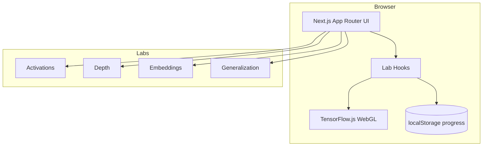

# Architecture Overview

Neural Truth Lab is a browser-only Next.js app. All ML training runs client-side via TensorFlow.js.

## System diagram

## Key directories

| Path | Role |
|------|------|
| `app/` | Routes, layout, metadata, OG image |
| `components/labs/` | Lab UIs (dynamic import, no SSR for TF.js) |
| `hooks/` | Training state, progress, keyboard, fullscreen |
| `training/` | TF.js models and metrics |
| `datasets/` | Synthetic data generators |
| `visualization/` | PCA, decision grids |
| `lib/` | Constants, progress, achievements, share |

## Data flow (typical lab)

1. User opens lab page → client component loads TF.js backend.
2. Hook builds model + dataset tensors.
3. Epoch loop trains with `tf.nextFrame()` between epochs.
4. Snapshots feed charts and canvas visualizations.
5. On completion → `markLabComplete` + achievement unlocks.

## Deployment

- **CI:** GitHub Actions (typecheck, lint, build)
- **Host:** Netlify with `@netlify/plugin-nextjs`
- **No backend:** progress stored in `localStorage` only

Full deployment steps: [`DEPLOYMENT.md`](./DEPLOYMENT.md).
