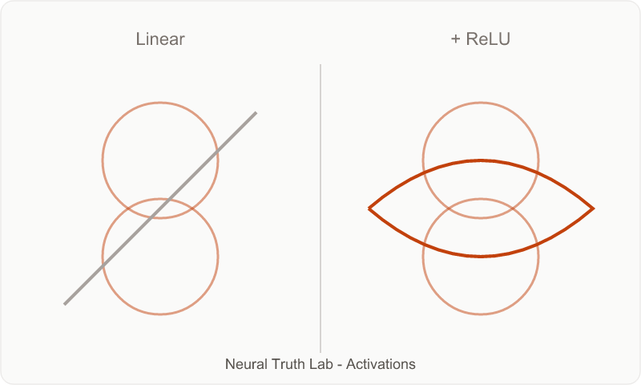
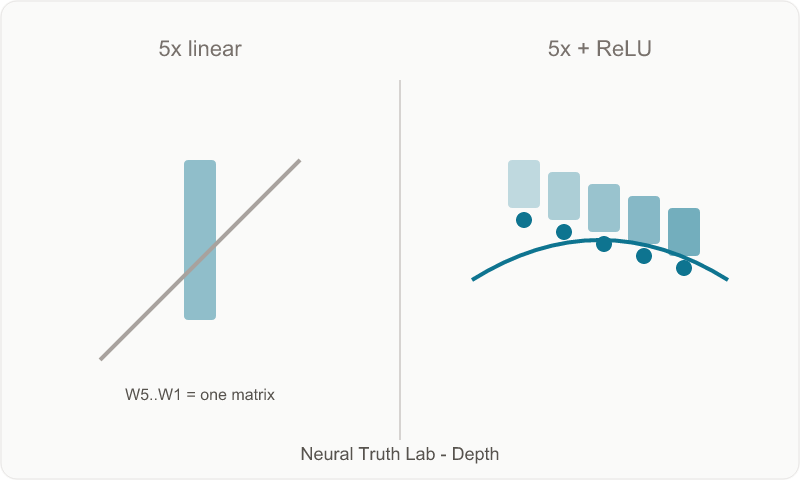
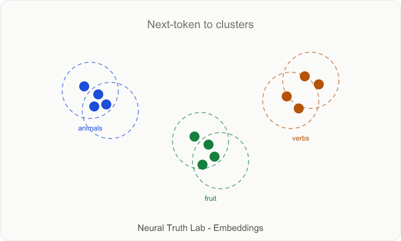
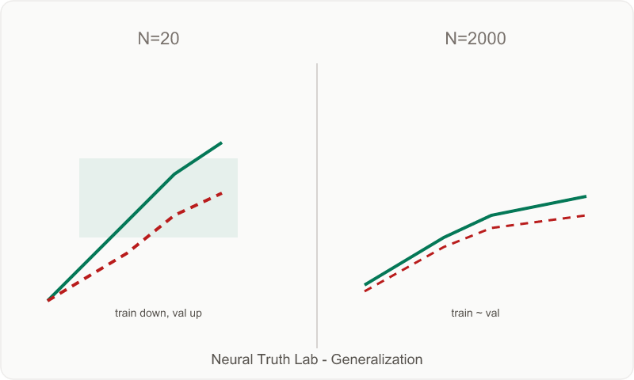

# Neural Truth Lab: Four Truths You Can See in Your Browser

**Subtitle:** ReLU's limits, GELU in transformers, and why PCA won't embed tomorrow's SKU.

**Tags:** Deep Learning · Machine Learning · Education · TensorFlow · Embeddings

**Live app:** [neural-truth-lab.netlify.app](https://neural-truth-lab.netlify.app) · **Code:** [github.com/sohamzycus/neural-truth-lab](https://github.com/sohamzycus/neural-truth-lab)

**Assets:** Infographics in [`docs/medium/`](./medium/) (SVG + PNG). Capture lab screenshots per checklist at bottom.

---

## Stop reading. Start seeing.

A slide says "ReLU introduces nonlinearity." You nod. Nothing moves.

**[Neural Truth Lab](https://neural-truth-lab.netlify.app)** trains real TensorFlow.js models in your browser. Scrub epochs. Watch decision boundaries bend. See embedding stars cluster. No GPU. No install.

| Lab | Truth |
|-----|-------|
| Activations | Nonlinearity is not optional |
| Depth | Depth without activation = one layer |
| Embeddings | Meaning emerges from context |
| Generalization | More data beats memorization |

---

## Lab 1: The line that cannot bend

Two models. Same concentric rings. Same optimizer and depth. Model A is linear; Model B adds **ReLU**.

Model A's boundary stays a **straight line** (~50% accuracy). Model B's **wraps** the inner ring by epoch ~75. Scrub the slider: A never curves; B does.

> **Nothing changed except ReLU.** Linear layers compose into one linear transform. Without nonlinearity between them, depth is decorative.

**Figure 2** *(capture from app):* side-by-side decision boundaries at epoch ~75. Use the lab's PNG export.

---

## Where ReLU fails (and where GELU / Leaky ReLU fit)

ReLU (`max(0, x)`) is cheap and works — the lab shows *why*. But it has three well-known cracks:

1. **Dying ReLU** — negative pre-activations get zero gradient; neurons stop learning permanently.
2. **Kink at zero** — derivative jumps 0 to 1; can hurt fine-grained regression or physics-informed nets.
3. **Hard zero on negatives** — magnitude of "how negative" is discarded entirely.

**Leaky ReLU** keeps a small slope `alpha * x` for `x <= 0` (alpha ~ 0.01). Gradients flow; neurons rarely die. Trade-off: less sparsity.

**GELU** (`x * Phi(x)`, Gaussian CDF) is the transformer default — smooth gating, no hard clip, stabler at depth. BERT, GPT, ViTs use GELU or SwiGLU, not ReLU.

| Activation | Best for | Watch out for |
|------------|----------|---------------|
| ReLU | CNNs, teaching, shallow MLPs | Dying units |
| Leaky ReLU | Deep MLPs, GANs | Extra hyperparameter |
| GELU | LLMs, modern encoders | Slightly slower |

Neural Truth Lab uses ReLU on purpose — smallest change that makes nonlinearity visible. Swap in GELU in the Depth lab and the boundary still curves; any nonlinearity breaks the matrix-collapse trick.

---

## Lab 2: Five layers, secretly one

Three models on the same rings: **1 linear**, **5 linear** (no activations), **5 + ReLU**.

Models 1 and 2 produce **identical** boundaries. The weight panel shows `W5 x W4 x ... x W1` collapsing to a single matrix. Model 3 finally bends.

> **Depth without activation is one layer in disguise.**

---

## Lab 3: Stars that cluster without labels

A toy language: `The {noun} eats`, animals, fruits, verbs. The model only predicts the **next token** — never told which words are animals.

16-dim learned vectors get projected to 2D with **PCA** each epoch. By ~150, animals, fruit, and verbs separate. Hover `cat` — neighbors are `dog`, `lion`, not `apple`.

**Figure 5** *(capture from app):* embedding galaxy at epoch 150+.

> **Meaning comes from context, not category labels.**

---

## Embeddings: three questions teams get wrong

### 1. How do embedding models work?

**Learned embeddings** (Word2Vec, GPT's embedding layer): each token has a trainable row in matrix `E[vocab, dim]`. Training pulls co-occurring tokens together — the distributional hypothesis.

**PCA / t-SNE** do not create meaning. They compress an *existing* matrix so humans can see it. **Training builds the space; PCA draws the map.**

### 2. PCA on embeddings — what about unseen words?

**PCA cannot invent a vector for a word it never saw.** It needs a row in the training matrix and a fitted basis.

| Approach | OOV handling |
|----------|----------------|
| `<UNK>` token | Coarse fallback |
| Subword tokenization (BPE) | `SKU-8842` splits into seen pieces |
| Encoder (BERT, E5) | Forward pass on new text yields a vector |

Enterprise anti-pattern: TF-IDF on catalog SKUs, PCA for "semantic search," demo works on training items, **fails on next quarter's part numbers.**

What works for unseen SKUs: subword/char tokenization, attribute-rich text (`title + category + specs`), fine-tuned encoders, **hybrid dense + BM25** for exact part-number matches.

### 3. How do SKU names work in production?

A catalog "word" might be `ACME-PUMP-3HP-SS-316L-2024Q1` — not WordNet.

| Toy lab | Enterprise |
|---------|------------|
| ~16 tokens | 10^5-10^7 SKUs |
| Closed vocab | New SKUs every quarter |
| Next-token loss | Search, substitute, compliance |

Production patterns: **two-tower retrieval** (query encoder + SKU encoder, train on clicks), **metadata fusion** (don't embed the SKU string alone), **hierarchical ID tokenization**, **cold-start fallbacks** (category centroid until clicks arrive), and **eval on held-out SKUs** — not just held-out queries.

The Embeddings lab is a microscope. Enterprise search is the same idea at warehouse scale, with OOV and hybrid retrieval baked in.

---

## Lab 4: When train loss lies

Same model, growing dataset (N = 20 to 20,000). On tiny N, train loss drops while validation rises — memorizing noise. As N grows, the curves reunite.

**Figure 7** *(capture from app):* train/val charts at N=20 vs N=2000.

---

## Try it

1. [neural-truth-lab.netlify.app](https://neural-truth-lab.netlify.app)
2. **Activations** - Train Both Models, scrub to epoch ~75
3. **Depth**, **Embeddings**, **Generalization** in order

Keyboard: `?` shortcuts, `F` fullscreen.

Open source: Next.js 15 static export, TensorFlow.js `model.fit()` in-browser, PCA every 5 epochs.

---

## Closing

Courses optimize for exam questions. Neural Truth Lab optimizes for **moments** — the epoch where a line fails, five matrices collapse into one, and `cat` drifts toward `dog` without a label.

ReLU is where the story starts. GELU is where industry moved. Enterprise embeddings are where the toy story meets cold-start SKUs and catalogs that never stop changing.

---

## Medium publish checklist

- [x] Figures 1, 3, 4, 6 — `docs/medium/infographic-*.png`
- [ ] Hero — landing page screenshot
- [ ] Figure 2 — Activations boundary PNG export (epoch ~75)
- [ ] Figure 5 — Embeddings galaxy (epoch 150+)
- [ ] Figure 7 — Generalization N=20 vs N=2000
- [ ] Link live app + GitHub in first 3 paragraphs
