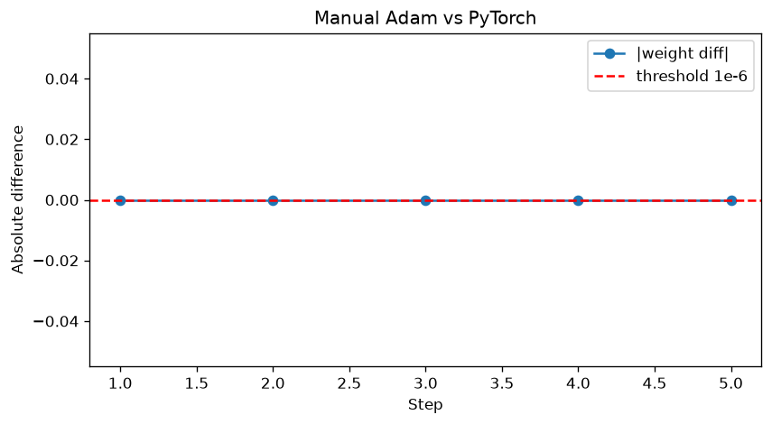
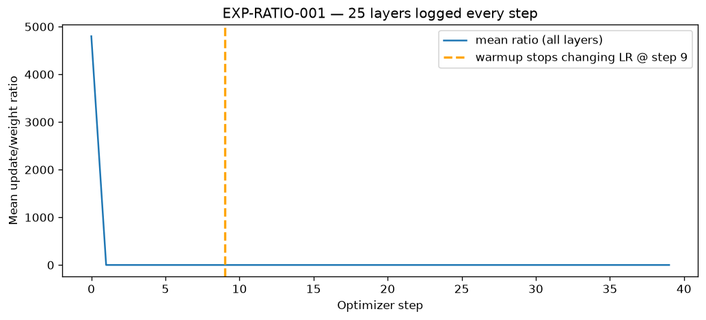
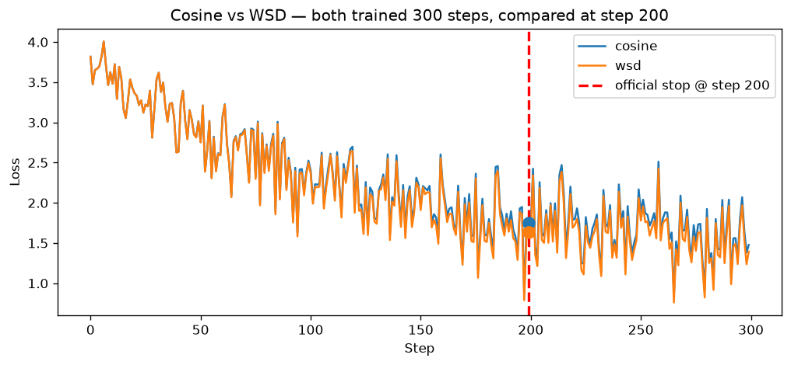
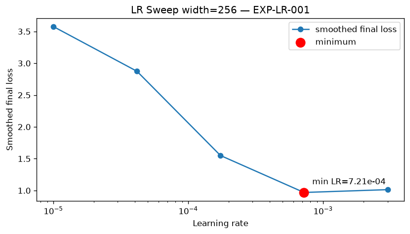
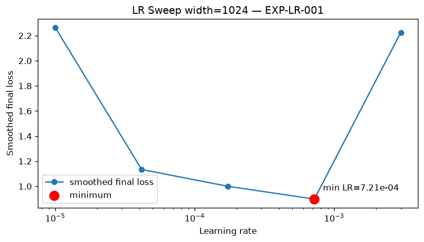

# ERA V5 Session 11 — Optimizer Evidence Lab

**Session 11 asks a different question than “did loss go down?”**  
It asks: *what exactly did we measure, under what controls, and how much should we trust the answer?*

Every number in the results sections is loaded from **`outputs/`** for this run (`execution_mode=smoke`).  
Regenerate after any run:

```bash
cd session11 && source .venv/bin/activate
python scripts/run_all.py --mode smoke
python scripts/generate_readme.py
python scripts/audit_submission.py
```

---

## Core idea: Optimizer Evidence Ledger

Optimizer claims are **hypotheses**, not facts, until they are linked to evidence:

```
spec (YAML) → experiment → raw CSV/JSON/plot → derived metric → decision → confidence
```

Each claim gets one row in [`outputs/evidence_ledger.jsonl`](outputs/evidence_ledger.jsonl).  
If a conclusion is missing from the ledger, it does not count.

| Claim | Experiment | Decision | Confidence | First artifact |
|-------|------------|----------|------------|----------------|
| CLAIM-001 | EXP-ADAM-001 | SUPPORTED | HIGH | `outputs/adam_manual_table.csv` |
| CLAIM-002 | EXP-BIAS-001 | NOT_REACHED | LOW | `outputs/bias_correction.json` |
| CLAIM-003 | EXP-RATIO-001 | SUPPORTED | MEDIUM | `outputs/layer_update_ratio.csv` |
| CLAIM-004 | EXP-SCHEDULE-001 | SUPPORTED | HIGH | `outputs/schedule_comparison.csv` |
| CLAIM-005 | EXP-LR-001 | SUPPORTED | MEDIUM | `outputs/lr_sweep.csv` |

Human-readable copy: [`outputs/evidence_ledger.md`](outputs/evidence_ledger.md)  
Plots + tables for this run: [`artifacts/run_report.md`](artifacts/run_report.md)

**Label key:** MEASURED = from a run; CALCULATED = deterministic transform; INFERRED = extrapolation; NOT_REACHED = threshold/window exhausted.

---

## Repository map

| Component | Role |
|-----------|------|
| `specs/` | Experiments, metrics, acceptance rules — validated before training |
| `src/experiments/` | Five experiment implementations (EXP-ADAM-001 … EXP-LR-001) |
| `src/validation/comparison_validator.py` | Blocks schedule A vs B if non-schedule controls differ |
| `src/reporting/ledger.py` | Writes EvidenceRecord entries |
| `scripts/run_all.py` | Full pipeline: specs → runs → ledger → README |
| `outputs/` | All artifacts for this run |

**Model:** tiny causal GPT + fixed word corpus, CPU-only, seed 1337.

---

## Experiment 1 — Manual Adam (EXP-ADAM-001)

**Question:** Does our hand-written Adam match `torch.optim.Adam` step for step?

**Setup:** one weight (0.5), five fixed gradients, lr=0.001, β=(0.9, 0.999), ε=1e-8.  
Manual code in `adam_manual.py` never imports PyTorch for the manual path.

**Update rule:**

```
m  = β1·m + (1−β1)·g
v  = β2·v + (1−β2)·g²
m̂ = m / (1−β1ᵗ)     v̂ = v / (1−β2ᵗ)
w  ← w − lr · m̂ / (√v̂ + ε)
```

**Results (smoke run):**

| Check | Value | Label |
|-------|------:|-------|
| max &#124;manual − torch&#124; | **1.041e-17** | CALCULATED |
| Claim status | SUPPORTED | — |

<p align="center">
  
</p>
<p align="center"><em>Figure 1 — Manual vs PyTorch weight difference per step (red line = 1e-6 tolerance)</em></p>


Each point is one optimizer step. The line stays below tolerance — manual and library agree to machine precision. CSV: [`outputs/adam_manual_vs_pytorch.csv`](outputs/adam_manual_vs_pytorch.csv).

---

## Experiment 2 — Bias correction on vs off (EXP-BIAS-001)

**Question:** How much do bias-corrected and uncorrected Adam differ, and after which step is the gap negligible?

**Setup:** 20 steps, identical gradients and hyperparameters; only the bias-correction flag changes.

**Convergence rule (from spec):** abs_diff &lt; 1e-6 **and** rel_diff &lt; 1e-4 for **3 consecutive steps**, else report `NOT_REACHED_WITHIN_WINDOW`.

**Results:**

| Metric | Value | Label |
|--------|------:|-------|
| Abs diff at step 1 | **2.1623e-03** | MEASURED |
| Step where diff stops mattering | **NOT_REACHED_WITHIN_WINDOW** | NOT_REACHED |
| Abs diff at step 20 | **1.9661e-02** | MEASURED |
| Claim status | NOT_REACHED | — |

<p align="center">
  
</p>
<p align="center"><em>Figure 2 — Bias correction ON vs OFF (trajectories, abs/rel diff, update magnitude)</em></p>


- **Top left:** weight paths diverge when correction is off.
- **Top right / bottom left:** differences stay above tolerance for all 20 steps → `NOT_REACHED_WITHIN_WINDOW`.
- **Bottom right:** uncorrected update magnitudes stay larger early on.

Full report: [`outputs/bias_correction_report.md`](outputs/bias_correction_report.md)

---

## Experiment 3 — Update-to-weight ratio (EXP-RATIO-001)

**Question:** When warmup ends, does the per-layer update size (relative to weight norm) change regime?

**Metric:** `ratio = ‖Δθ‖ / max(‖θ‖, ε)` using the **actual weight change** after `optimizer.step()`, not the gradient.

**Results:**

| Metric | Value | Label |
|--------|------:|-------|
| Layers logged | **25** | MEASURED |
| Warmup ends at step | **9** | MEASURED |
| Mean ratio before warmup | **4.80e+02** | MEASURED |
| Mean ratio after warmup | **1.17e-02** | MEASURED |
| Stabilization step | **NOT_REACHED** | NOT_REACHED |

<p align="center">
  
</p>
<p align="center"><em>Figure 3 — Mean update/weight ratio (warmup ends at step 9)</em></p>


Ratio is high during warmup, then drops after step 9 when the schedule multiplier saturates.

<p align="center">
  
</p>
<p align="center"><em>Figure 4 — Per-layer ratio heatmap (sample layers × steps)</em></p>


Each row is a layer; color shift at the warmup boundary marks the same transition across layers.

Raw log: [`outputs/layer_update_ratio.csv`](outputs/layer_update_ratio.csv)

---

## Experiment 4 — Cosine vs WSD schedules (EXP-SCHEDULE-001)

**Question:** At the official checkpoint (step 200), which schedule gives lower loss when **everything else is locked**?

**Controls matched:** model, init weights, data order, seed, AdamW hyperparameters, batch size, dtype, clipping, weight decay, 300 total steps.  
**Only variable:** schedule type. Validator status: **VALID**.

**Schedule definitions (in spec):**
- **Cosine:** warmup → cosine decay to min LR
- **WSD:** warmup → stable plateau → cosine decay

**Results at checkpoint step 200:**

| Schedule | Loss @ step 200 | Loss @ step 300 | Label |
|----------|----------------:|----------------:|-------|
| cosine | **1.7466** | 1.4769 | MEASURED |
| wsd | **1.6353** | 1.3926 | MEASURED |

| Decision field | Value |
|----------------|-------|
| Relative gap @ 200 | 6.8% |
| Checkpoint choice | **WSD** |
| Policy decision | SUPPORTED |

Step 200 is the **official** comparison point. Step 300 is **diagnostic** only.

<p align="center">
  
</p>
<p align="center"><em>Figure 5 — Training loss (vertical marker = step 200 checkpoint)</em></p>


At step 200, the lower curve wins — **WSD** in this run.

<p align="center">
  
</p>
<p align="center"><em>Figure 6 — Learning-rate multiplier over time (cosine vs WSD)</em></p>


WSD holds a mid-training plateau; cosine decays throughout — same optimizer, different effective LR budget.

Evidence: [`outputs/schedule_comparison.csv`](outputs/schedule_comparison.csv)

---

## Experiment 5 — Learning-rate sweep (EXP-LR-001)

**Question:** For widths 256, 512, and 1024, which learning rate minimizes smoothed final loss? What LR would we **guess** at width 4096 without running it?

**Setup:** log-spaced LR grid, AdamW + WSD, smoothed final loss = mean of last 5 steps.  
Red markers on plots = measured minimum per width.

**Measured minima:**

| Width | Best LR | Loss at min | Label |
|------:|--------:|------------:|-------|
| 256 | **7.2084e-04** | 0.9695 | MEASURED |
| 512 | **7.2084e-04** | 0.9103 | MEASURED |
| 1024 | **7.2084e-04** | 0.8987 | MEASURED |

**Width 4096 (not run):**

| Field | Value | Label |
|-------|-------|-------|
| Proposed LR | **7.2084e-04** | INFERRED |
| Confidence | **LOW** | — |

No row for width 4096 in [`outputs/lr_sweep.csv`](outputs/lr_sweep.csv).

<p align="center">
  
</p>
<p align="center"><em>Figure 7 — Smoothed final loss vs LR (all widths; dots = minima)</em></p>


**Width 256** — best LR **7.2084e-04**, loss at min **0.9695** (MEASURED)

<p align="center">
  
</p>
<p align="center"><em>Figure — LR sweep at hidden size 256 (red dot = minimum)</em></p>


**Width 512** — best LR **7.2084e-04**, loss at min **0.9103** (MEASURED)

<p align="center">
  
</p>
<p align="center"><em>Figure — LR sweep at hidden size 512 (red dot = minimum)</em></p>


**Width 1024** — best LR **7.2084e-04**, loss at min **0.8987** (MEASURED)

<p align="center">
  
</p>
<p align="center"><em>Figure — LR sweep at hidden size 1024 (red dot = minimum)</em></p>


U-shaped curves: too-small LR under-trains, too-large LR diverges. Width 4096 uses **INFERRED** LR **7.2084e-04** (confidence **LOW**) only.

Details: [`outputs/lr_sweep_decision.md`](outputs/lr_sweep_decision.md)

---

## Summary

| # | Experiment | Main takeaway from this run |
|---|------------|----------------------------|
| 1 | EXP-ADAM-001 | Manual Adam matches PyTorch to ~1e-17 — implementation is trustworthy |
| 2 | EXP-BIAS-001 | Early difference is real; 20-step window did **not** reach convergence tolerance |
| 3 | EXP-RATIO-001 | Warmup ends at step 9; ratio regime changes there |
| 4 | EXP-SCHEDULE-001 | At step 200, **WSD** wins under validated controls |
| 5 | EXP-LR-001 | Min LR measured at 256/512/1024; 4096 is INFERRED only |

---

## Install

```bash
cd session11
python3 -m venv .venv && source .venv/bin/activate
pip install -r requirements.txt
```

## Full reproduction

```bash
python scripts/validate_specs.py
python scripts/run_all.py --mode smoke
python scripts/generate_readme.py
python scripts/audit_submission.py
```

Specs: [`specs/`](specs/) · Traceability: [`artifacts/traceability_matrix.md`](artifacts/traceability_matrix.md)

---

## Limitations

- Small model and corpus — results illustrate the **evidence workflow**, not SOTA training
- Single seed — no replication variance
- Width 4096 not trained — INFERRED LR only
- Bias convergence NOT_REACHED in 20 steps under stated tolerances
- Smoke mode uses a 5-point LR grid (`--mode full` uses 7 points)
