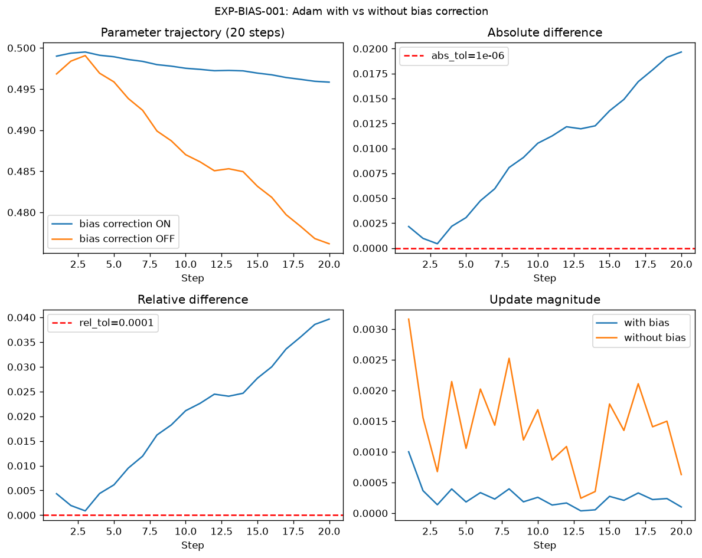
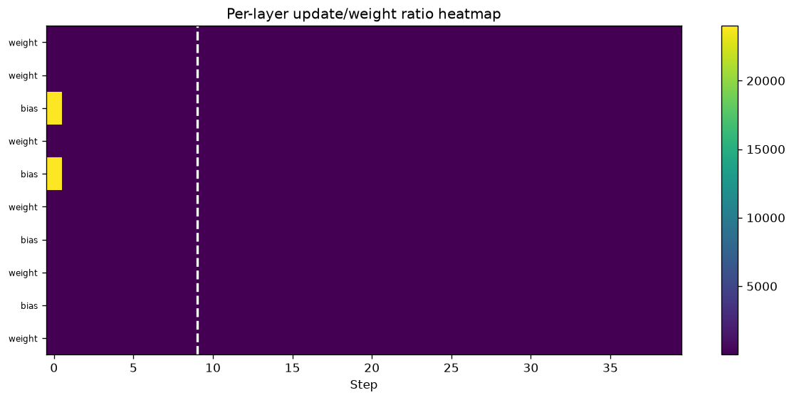
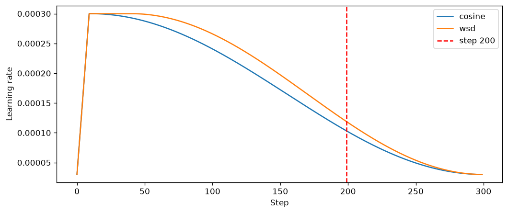
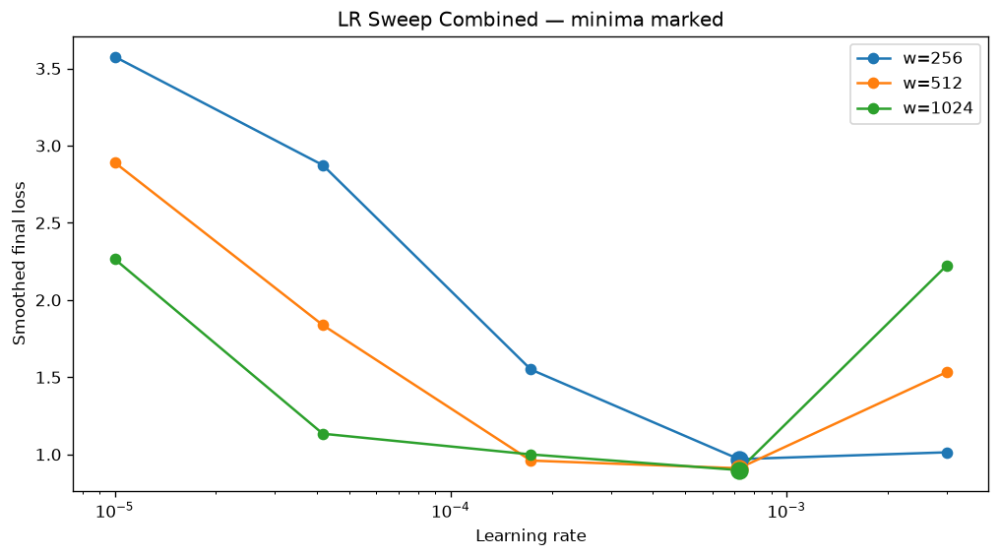
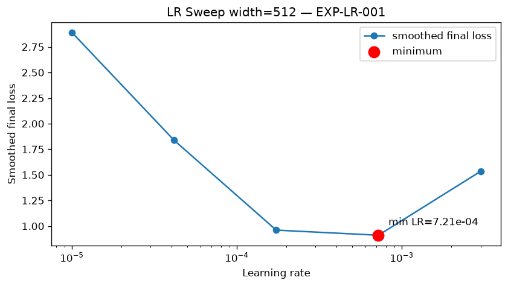

# Session 11 Graphical Run Report

**Pipeline mode:** `smoke`  
**Ledger execution_mode(s):** `smoke`  
**Generated from:** `outputs/` artifacts only

---

## Evidence chain (novelty)

Each row: **Claim → Experiment → Raw file → Metric → Decision**

| Claim | Experiment | Evidence file | Decision |
|-------|------------|---------------|----------|
| CLAIM-001 | EXP-ADAM-001 | `outputs/adam_manual_vs_pytorch.csv` | see ledger |
| CLAIM-002 | EXP-BIAS-001 | `outputs/bias_correction.json` | NOT_REACHED |
| CLAIM-003 | EXP-RATIO-001 | `outputs/layer_update_ratio.csv` | see ledger |
| CLAIM-004 | EXP-SCHEDULE-001 | `outputs/schedule_comparison.csv` | SUPPORTED |
| CLAIM-005 | EXP-LR-001 | `outputs/lr_sweep.csv` | see ledger |

Full ledger: `outputs/evidence_ledger.jsonl`

---

## EXP-ADAM-001 — Manual Adam


# Adam Manual Verification — EXP-ADAM-001

**Execution mode:** smoke
**Max absolute difference:** 1.04e-17 (CALCULATED)
**Decision:** SUPPORTED
**Confidence:** HIGH

All values compared: m_t, v_t, m_hat_t, v_hat_t, signed_step, updated_weight.

---

## EXP-BIAS-001 — Bias correction (20 steps, ON vs OFF)



| Metric | Value | Label |
|--------|------:|-------|
| Early abs diff step 1 | 0.0021622677602000095 | MEASURED |
| Difference stops mattering at step | NOT_REACHED_WITHIN_WINDOW | NOT_REACHED |
| Final abs diff | 0.019661114257884416 | MEASURED |

---

## EXP-RATIO-001 — Update/weight ratio (every layer)




| Metric | Value | Label |
|--------|------:|-------|
| Layers logged | 25 | MEASURED |
| Warmup stops changing LR at step | 9 | MEASURED |
| Stabilization step | None | NOT_REACHED |

---

## EXP-SCHEDULE-001 — Cosine vs WSD (300 steps, compare @ 200)




| Schedule | Loss @ step 200 | Label |
|----------|----------------:|-------|
| cosine | 1.746608853340149 | MEASURED |
| wsd | 1.635306477546692 | MEASURED |

**Model I would keep:** WSD (CALCULATED from step-200 loss under validated controls)

---

## EXP-LR-001 — LR sweep (widths 256, 512, 1024)







### Measured minima

| Width | Best LR | Label |
|------:|--------:|-------|
| 256 | NOT RUN | NOT_REACHED |
| 512 | NOT RUN | NOT_REACHED |
| 1024 | NOT RUN | NOT_REACHED |

### Width 4096 (INFERRED — not measured)

| Field | Value |
|-------|-------|
| Proposed LR | 7.2084e-04 (INFERRED) |
| Confidence | LOW |
| Method | log-log linear fit on measured minima |

---

## Reproduce this report

```bash
cd session11 && source .venv/bin/activate
python scripts/run_all.py --mode smoke
python scripts/audit_submission.py
```
