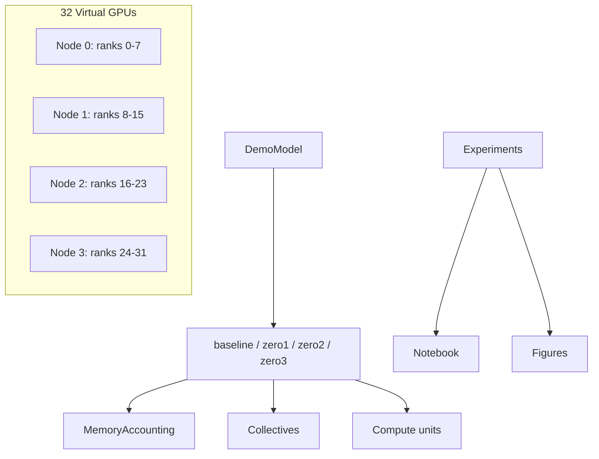

# ERA V5 Session 12 — 32 GPU ZeRO Simulator

## 1. What This Project Demonstrates

A **32 virtual GPU** training-systems laboratory on CPU. It compares baseline data parallelism with ZeRO stages 1–3 using explicit **ownership maps**, **memory formulas**, **collectives** (all-reduce, reduce-scatter, all-gather), **topology-aware communication**, and **compute vs communication** timing — all labeled as **simulation assumptions**, not hardware benchmarks.

## 2. Assignment

Build an original, reproducible simulator for 32 virtual GPUs that demonstrates understanding of data parallelism, ZeRO-1/2/3, GPU memory accounting, communication, computation, sharding, collectives, and memory vs communication trade-offs — with evidence chains from code → experiment → measured output → interpretation in the notebook.

## 3. Important Disclaimer

This is a **virtual-GPU educational simulator**. It does **not** claim to reproduce physical NVIDIA GPU performance. Bandwidth, latency, and step times are **simulation assumptions**.

## 4. What I Built

| Piece | Location |
|-------|----------|
| 32 `VirtualGPU` objects | `src/virtual_gpu.py` |
| 4 nodes × 8 GPUs/node topology | `src/config.py` |
| Demo transformer-like model | `src/model.py` |
| Memory accounting | `src/memory.py` |
| Communication model | `src/communication.py` |
| ZeRO strategies | `src/strategies/` |
| Experiment matrix | `src/experiments.py` |
| Plots | `src/visualization.py`, `outputs/figures/` |
| Notebook | `notebooks/session12_zero_32gpu_simulation.ipynb` |
| Spec | `specs/session12-zero-simulator.md` |

## 5. Architecture



## 6. Data Parallelism

Each GPU holds **full** parameters, gradients, and Adam state. After backward, **all-reduce** synchronizes gradients. Aggregate compute scales; **per-GPU model-state memory does not shrink** with more GPUs.

## 7. ZeRO-1

Parameters and gradients **replicated**; **optimizer state sharded** across ranks (ownership sets in `assign_zero1_optimizer_shard`).

## 8. ZeRO-2

Parameters **replicated**; **gradients and optimizer sharded**. Backward followed by **reduce-scatter** on gradients.

## 9. ZeRO-3

Parameters, gradients, and optimizer **sharded** at rest. The step **all-gathers parameter shards** when the full parameter view is required, **reduce-scatters** gradients back into shards, and **all-gathers parameter shards** again after the local optimizer update (`zero3.py`). Communication increases — trade-off is intentional.

## 10. Communication

| Collective | Used in |
|------------|---------|
| `all_reduce` | Baseline DP, ZeRO-1 gradient sync |
| `reduce_scatter` | ZeRO-2/3 gradients |
| `all_gather` | ZeRO-3 parameters |

All return bytes, intra/inter split, and **simulated** time from configurable Gbps (not measured hardware).

## 11. Memory Model

Per element on a GPU (see `MemoryAccounting`):

- Parameters: `|param_element_ids| × bytes_per_param_train` (default 2 = bf16)
- Gradients: `|grad_element_ids| × bytes_per_param_train`
- FP32 master (optional): `|param_element_ids| × 4`
- Adam: `|optimizer_element_ids| × 4 × 2` (m and v in FP32)
- Activations: `seq_len × hidden × layers × batch × bytes_per_activation`
- Temporary (ZeRO-3): `temp_full_param_elements × bytes_per_param_train` during all-gather windows

## 12. Experiments

| ID | Description |
|----|-------------|
| exp1–4 | Baseline, ZeRO-1, ZeRO-2, ZeRO-3 |
| exp5 | ZeRO-3 single-node bandwidth assumption |
| exp6 | ZeRO-3 multi-node default |
| exp7 | ZeRO-3 bucket size large vs small |
| exp8 | Model size sweep |
| scaling_ws* | Baseline world size 1→32 |

## 13. Results

After `python scripts/run_all.py`, see `outputs/figures/*.png` and `outputs/experiment_matrix.json`.

## 14. What the Results Actually Show

Factual outputs are **only** those written by the simulator to `outputs/` on your machine. Re-run `scripts/run_all.py` after any code change; do not trust stale numbers in this README.

## 15. My Understanding

Reflections live in `notebooks/session12_zero_32gpu_simulation.ipynb` (section **What I Understood**, per-experiment answers, seven-question summary, and **My Understanding — Final Reflection**). They are tied to `outputs/experiment_matrix.json` from the default 1M-parameter / 32-GPU run.

Short version: **ownership sets** on each `VirtualGPU` drive memory; each ZeRO stage shards one more tensor class (optimizer → gradients → parameters). ZeRO-3 lowers steady model-state memory (~0.55 MB/GPU in aggregate accounting vs ~16 MB baseline peak) but logs more communication bytes (6M vs 4M) and a higher **peak** (~2.58 MB) when gathers materialize a full parameter view. All timings are simulation assumptions, not GPU benchmarks.

## 16. What Surprised Me

- ZeRO-3 **communication_bytes** (6,000,000) exceeded baseline (4,000,000) even though steady memory dropped sharply — sharding does not remove collectives.
- **Peak** ZeRO-3 memory (~2,578,884 bytes/GPU) vs steady (~578,884 bytes/GPU in the matrix) — the gather window matters for capacity planning.

## 17. Limitations

- No real NCCL, no CUDA, no DeepSpeed scheduler
- Communication time is a simple bandwidth/latency model
- Overlap is **conceptual** (`overlap_adjusted_time`), not a cycle-accurate pipeline

## 18. How This Differs From Real DeepSpeed/FSDP

DeepSpeed/FSDP fuse kernels, bucket gradients, overlap communication with backward, and run on real hardware. This project exposes **ownership and byte accounting** for teaching — not production throughput.

## 19. Reproducibility

```bash
cd session12
python3 -m venv .venv && source .venv/bin/activate
pip install -r requirements.txt
python scripts/run_all.py
pytest tests -q
jupyter nbconvert --to notebook --execute notebooks/session12_zero_32gpu_simulation.ipynb --output session12_zero_32gpu_simulation.executed.ipynb
```

## 20. Repository Structure

```
session12/
  specs/session12-zero-simulator.md
  src/
  tests/
  notebooks/
  scripts/run_all.py
  outputs/
  README.md
```

## 21. Assignment Completion Checklist

- [x] 32 explicit VirtualGPU objects
- [x] Baseline + ZeRO-1/2/3 with ownership maps
- [x] Memory, communication, compute models
- [x] Experiment matrix + plots from simulator output
- [x] Tests for sharding invariants
- [x] Notebook reflections completed (evidence-linked)
- [x] README aligned with notebook interpretations

## Concept → Code → Evidence

| Concept | Where implemented | Evidence produced | Interpretation (notebook) |
|---------|-------------------|-------------------|---------------------------|
| Data Parallelism | `src/strategies/baseline.py` | exp1 peak ~16 MB/GPU | Full replication per rank |
| All-reduce | `src/communication.py` | 4,000,000 bytes baseline | Full-gradient sync |
| ZeRO-1 | `zero1.py`, `assign_zero1_optimizer_shard` | peak ~8.3 MB/GPU | Optimizer-only shard |
| ZeRO-2 | `zero2.py` | peak ~6.4 MB, 2M comm bytes | + gradient shard |
| ZeRO-3 | `zero3.py` | steady ~0.55 MB, peak ~2.58 MB, 6M comm | gather/scatter trade-off |
| Reduce-scatter | `communication.reduce_scatter` | zero2/3 rows | Gradient ownership |
| All-gather | `communication.all_gather` | zero3 comm | Rebuild param view |
| Memory sharding | `virtual_gpu.py` | tests + sanity cells | Partitions sum to full |
| Communication cost | `communication.py` | exp5 vs exp6 time | Topology on same bytes |
| Compute/comm overlap | `overlap_adjusted_time` | overlap cell + exp7 | Conceptual buckets |
