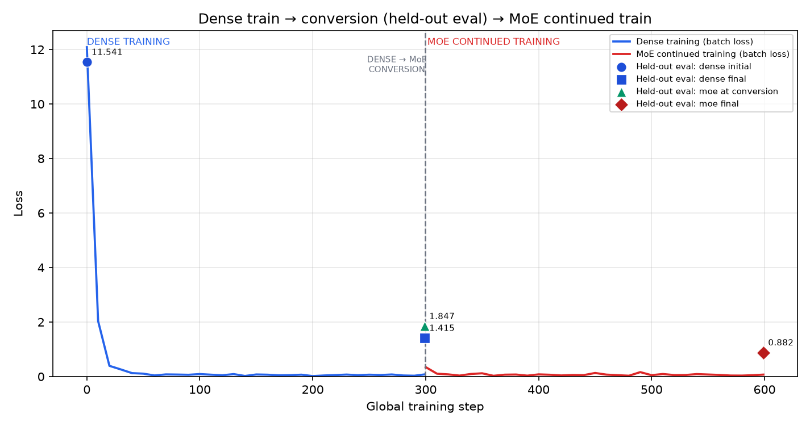
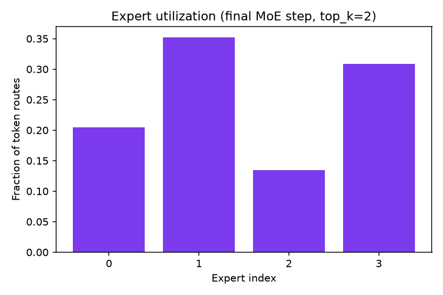

# ERA V5 Session 14 — Dense → MoE

## Assignment

Train a small dense language model, convert its trained FFN into a routed mixture-of-experts (MoE), then **continue training** the converted model and show that held-out loss decreases—not train a fresh random MoE.

## Result

```
Dense trained
      ↓
Dense → MoE conversion
      ↓
MoE held-out loss: 1.8475
      ↓
Continue training
      ↓
MoE held-out loss: 0.8816
```

**YES — the converted MoE continued training and reduced held-out loss by 0.9659.**

(Source: [`results/experiment_summary.json`](results/experiment_summary.json))

## Why this proves the assignment

1. The MoE was initialized from the trained dense checkpoint (`results/checkpoints/dense_final.pt`).
2. The MoE was **not** independently trained from random initialization (`continuation_source`: `trained dense checkpoint`).
3. The acceptance comparison is **MoE at conversion** vs **MoE after continued training**, both on the same held-out split.

## Experiment in one picture

```
Dense training (train split only)
        ↓
  dense_final.pt checkpoint
        ↓
  convert_dense_to_moe()
        ↓
  held-out eval at conversion
        ↓
  MoE continued training (train split only)
        ↓
  lower held-out eval loss
```



## Model

| Parameter | Value |
|---|---|
| Dataset | TinyCorpus (32 sentences, 80/20 split) |
| Tokenizer | Word-level (`<pad>`, `<unk>` + sorted vocabulary) |
| Layers | 3 |
| Hidden size | 128 |
| Dense FFN size | 512 (4 × 128) |
| Experts | 4 |
| Top-K | 2 |
| Context length | 32 |
| Seed | 1337 |
| Dense total parameters | 599,936 |

## What exactly was converted?

Dense FFN per block: `128 → 512 → 128` (GELU).

MoE FFN per block: `router → top-2 experts → weighted sum` with the same input/output width `128`.

## What changed at conversion?

```
Dense FFN weights
      ↓ partition intermediate axis
4 expert FFN slices (copied from trained dense)
      ↓
+ new zero-init router per layer
      ↓
Top-2 routing (deterministic tie-break at step 0)
```

## Held-out evaluation

Training uses the **train split** only (`make_train_batch`). Reported evaluation loss is measured on a **deterministic held-out split** (`make_eval_batch`, seed `4242`). Train size: **25** sentences; held-out size: **7** sentences.

## Dense training

- Dense final held-out loss: **1.4148**
- Checkpoint: `results/checkpoints/dense_final.pt` (generated by runner)
- Logs: [`results/dense_train.csv`](results/dense_train.csv) (batch training loss)

## Conversion

`convert_dense_to_moe()` in [`src/moe.py`](src/moe.py) copies non-FFN weights, partitions each dense FFN into expert slices, and adds routers. Router logits are zero-initialized, producing uniform router probabilities at conversion; deterministic Top-K tie-breaking initially routes traffic to the same experts.

Report: [`results/conversion_report.json`](results/conversion_report.json)

## Conversion fidelity

Probe batch: same held-out batch before/after conversion ([`results/conversion_fidelity.json`](results/conversion_fidelity.json)):

| Metric | Value |
|---|---:|
| Dense output loss | 1.4148 |
| Converted MoE output loss | 1.8475 |
| Logits MSE | 17.9956 |
| Loss delta (MoE − dense) | 0.4327 |

The conversion **increases** loss on the probe batch because Top-2 uses only part of the partitioned FFN at once; continued MoE training recovers and improves.

The loss increase at conversion is not hidden; it is part of the experiment. The important assignment test is whether the converted model can recover and improve through continued training.

## Training continuation

The MoE was initialized from the **trained dense checkpoint** (`continuation_source`: `trained dense checkpoint`). It was **not** trained from random initialization. `optimizer_reset_at_conversion`: **true** (new AdamW after architecture change; model weights come from dense).

## MoE training

Logs: [`results/moe_train.csv`](results/moe_train.csv) · [`results/routing_stats.csv`](results/routing_stats.csv) · [`results/routing_summary.json`](results/routing_summary.json)

### Routing evolution (from logs)

| Step | E0 | E1 | E2 | E3 |
|---|---:|---:|---:|---:|
| conversion | 0.500 | 0.500 | 0.000 | 0.000 |
| plus_10 | 0.076 | 0.389 | 0.247 | 0.289 |
| midpoint | 0.055 | 0.281 | 0.213 | 0.452 |
| final | 0.204 | 0.352 | 0.135 | 0.309 |

## Results

| Stage | Held-out Loss |
|---|---:|
| Dense initial | 11.5407 |
| Dense final | 1.4148 |
| MoE at conversion | 1.8475 |
| MoE final | 0.8816 |

**MoE loss reduction:** 1.8475 → 0.8816 · **Delta = -0.9659**

**Did the converted MoE continue training and reduce held-out loss?**

**YES** — see [`results/experiment_summary.json`](results/experiment_summary.json).

Pre-strengthening baseline preserved in [`results/baseline_summary.json`](results/baseline_summary.json).

## Routing behaviour

All 4 experts received traffic by the final logged step. Routing diversified across all four experts, although utilization remained uneven (range 0.1348–0.3522, spread 0.2174).



## Parameter accounting

| Field | Value |
|---|---:|
| Dense total parameters | 599,936 |
| MoE total parameters | 601,472 |
| Dense FFN parameters | 393,216 |
| MoE total expert parameters | 393,216 |
| Router parameters per layer | 512 |
| Active expert parameters / token | 196,608 |
| Active router parameters / token | 1,536 |
| Active MoE FFN + router parameters / token | 198,144 |

## Evidence

1. [`results/loss_curve.png`](results/loss_curve.png)
2. [`results/conversion_report.json`](results/conversion_report.json)
3. [`results/conversion_fidelity.json`](results/conversion_fidelity.json)
4. [`results/dense_train.csv`](results/dense_train.csv) / [`results/moe_train.csv`](results/moe_train.csv)
5. [`results/routing_stats.csv`](results/routing_stats.csv) / [`results/routing_summary.json`](results/routing_summary.json)

## Reproduce

```bash
cd session14
python3 -m venv .venv && .venv/bin/pip install -r requirements.txt
.venv/bin/python scripts/run_session14.py
```

**Expected result:** MoE held-out loss should decrease from the conversion checkpoint after the continued-training phase. Exact values may vary slightly by device (CPU/MPS/CUDA); check `results/experiment_summary.json` for measured numbers.

## Tests

```bash
cd session14
.venv/bin/python -m pytest -q tests
```

## Submission checklist

- [x] Dense model trained
- [x] Dense checkpoint used for conversion
- [x] Dense → MoE conversion implemented
- [x] Held-out evaluation
- [x] MoE continued training
- [x] Held-out loss decreased
- [x] Training logs committed
- [x] Conversion evidence committed
- [x] Routing evidence committed
- [x] Reproduction command documented
- [x] Tests documented

Assignment status: PASS
