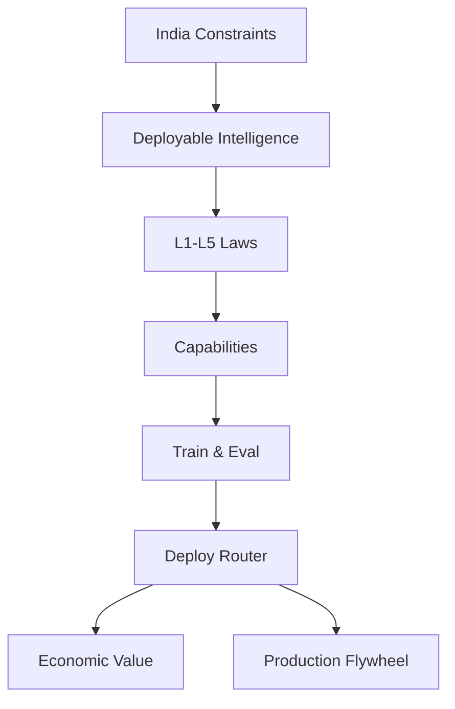
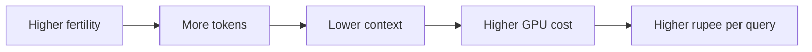
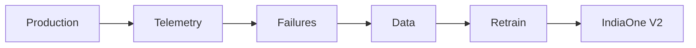

# IndiaOne-40B — Internal Research Proposal

**v2.3** · `python scripts/derive_all.py` → `data/derived/*.json`

---

# §0 Why IndiaOne Should Exist

> **Deployable Intelligence** — maximize useful work completed per rupee of inference, not benchmark score, under India's GPU-scarce, bandwidth-limited, code-switching deployment reality.

## Observation

India's binding constraint is not pretraining data—it is **served tokens per correct answer**. Imported tokenizers impose **21–45% more Indic tokens/query** (1.46→1.14 fertility). At scale that is **$13M/year** inference tax—often exceeding pretrain compute—before SMEs fail on latency and mobile bandwidth.

## Hypothesis

Co-designing **tokenizer + capability contract + ship gates** around **₹/query** makes a 40B model viable on **2×L40S** where fine-tuned Gemma/Llama/Qwen cannot: vocabulary is **infrastructure**, not a fine-tuning patch. Competing "Gemma-India" or "Llama-Bharat" proposals optimize **training loss**; IndiaOne optimizes **deployment economics**.

## Problem

Population-scale gov digitization and SME automation need models that are **multilingual, faithful, and cheap to serve** on India-hosted hardware. Leaderboard models optimize English MMLU—a different objective.

## Five Engineering Laws

| Law | Statement | Governs |
|-----|-----------|---------|
| **L1** | Capabilities define data—not the reverse. | §1, §3 |
| **L2** | Ship on deployment gates; benchmarks inform only. | §9, §11 |
| **L3** | Inference tokens are the fundamental currency of deployment. | §5–§6, §10 |
| **L4** | Tokenizer choice is permanent infrastructure. | §5–§6 |
| **L5** | Unmeasured capability is uncommitted capability. | §1, §8, §9 |

## Success metric

**Fertility 1.14** · **TCO $64M→$19M** (blended) · **Gov/Edu ≥0.78** · **Recovery ≥0.70** · **Kill:** faithfulness <0.75 · recovery <0.55 @M16 · TCO savings <10% vs generic.

## Causal spine



**India-only objective:** minimize **tokens per correct answer** under code-switch + frugal edge—objective does not exist for US-cloud EN-first models.

---

# §1 Mission & Capability Contract

**Upstream:** Sponsor mandate for India-sovereign foundation model.  
**Downstream:** §3 data derivation, §9 eval hierarchy, §10 deployment SLOs.

## 1.1 Problem Statement

India requires a foundation model that simultaneously satisfies four constraints no incumbent open-weight model optimizes jointly:

1. **Multilingual fidelity** across 22 scheduled languages with code-switching stability (Hinglish, Tanglish, Manglish).
2. **Domain grounding** in Indian economic infrastructure (UPI, GST, ONDC, Aadhaar consent language, RBI policy).
3. **Agentic reliability** for SME and government workflows (tool use, planning, recovery after failure).
4. **Frugal inference** on India-hosted GPUs (2× L40S per replica, p99 < 800ms Mumbai).

Existing models (Llama-3, Mistral, Qwen) optimize English MMLU. Indic fertility on generic tokenizers runs **1.38–1.52 tokens/word** vs **0.80** for English—directly inflating ₹/query and blocking SME adoption.

## 1.2 Design Options

| Option | Capabilities covered | Train cost | Inference TCO | India differentiation |
|--------|---------------------|------------|---------------|----------------------|
| Fine-tune Gemma 27B | Partial (EN vocab) | Low | Medium | Weak—Indic fertility + no gov data flywheel |
| Fine-tune foreign 70B | Partial (no tokenizer) | Low | High | Weak—fertility unchanged |
| 40B India-first (proposed) | Full 10-capability contract | Medium | Medium | Strong—MCDA + tokenizer |
| 40B MoE | Full but uneven | Medium-low active | Complex | Medium—routing risk |
| 8B + RAG only | Retrieval-heavy | Low | Low | No foundation novelty |

## 1.3 Tradeoff Analysis

| Dimension | Optimize for EN benchmarks | Optimize for India deploy (chosen) |
|-----------|---------------------------|-----------------------------------|
| Language mix | EN web dominance | MCDA-7: Hindi 17.9%, EN-IN 17.4% |
| Tokenizer | 128k generic BPE | 128k script-aware Unigram+BPE |
| Eval gate | MMLU, HumanEval | Indic-Faithfulness 0.82, Agent Recovery 0.70 |
| Success metric | Leaderboard rank | ₹/query, gov pilot milestone |

## 1.4 Decision Matrix Reference

No standalone matrix for mission framing; architecture choice deferred to **M12** (40B dense GQA). Capability count and SLOs locked in `capability_data.json` (10 capabilities).

## 1.5 Chosen Design — Ten-Capability Contract

| ID | Capability | Required behaviour | Pretrain tokens (B) | Primary eval (§9) |
|----|------------|-------------------|--------------------:|-------------------|
| `multilingual_indic` | Multilingual Indic fluency | 15-language generation; register control | 984 (NL slice) | IndicGLUE, FLORES |
| `code_switch` | Code-switching | Stable mixed-script; no collapse | 28 | CS Index ≥ 0.75 |
| `indian_reasoning` | Indian contextual reasoning | UPI, GST, ONDC, Aadhaar flows | 18 | Gov/Edu 0.78 |
| `coding` | Software engineering | Repo maintenance, tests, PRs | 144 | SWE-bench lite |
| `math` | Math & exam reasoning | JEE/NEET multi-step; bilingual | 48 | JEE-style set |
| `science` | Science & health literacy | Indian syllabus; ICMR names | 22 | NCERT tutor |
| `agentic` | Agentic tool use | Plan → execute → reflect → recover | 12 (+10B post) | Recovery ≥ 0.70 |
| `conversation` | Dialogue & instruction | Multi-turn; Indic politeness | 35 | BPO adherence |
| `long_context` | Long-context retrieval | 32k train → 128k deploy | 15 | Needle 128k |
| `planning` | Planning & reflection | JSON plans ≥5 steps | 8 | Planning depth |

**Capability count:** 10 (verified in `capability_data.json`).

## 1.6 Rejected Alternatives

| Alternative | Rejection rationale |
|-------------|---------------------|
| Capability-free data shopping list | No traceability from sponsor goals to token budgets |
| Population-only weighting | Hindi 39.2% overfits informal web; Dravidian 17.9% pop → 28.4% MCDA needed |
| English-only SFT for code-switch | Emergent CS unreliable; 41% recovery vs 70% target |
| LeetCode-heavy code mix | CP >2% overfits syntax not repo maintenance |
| ReAct-only agent training | 41% recovery vs 70% target with ToolLoop traces |

## 1.7 Expected Failure Modes

| Failure | Symptom | Detection |
|---------|---------|-----------|
| Capability drift | Coding improves, Indic regresses | L2 aggregate < 0.78 |
| US-centric financial reasoning | Wrong GST slab answers | `indian_reasoning` held-out QA |
| Single-turn collapse | Multi-turn incoherence | `conversation` BPO scripts fail |
| Implicit planning only | No structured JSON plans | `planning` depth < 5 steps |

## 1.8 Validation Plan

- Map each capability to ≥1 row in `eval_hierarchy.json` (10/10 covered).
- Pre-train milestone reviews at 25%/50%/75% tokens: per-capability loss curves vs EN slice.
- Sponsor sign-off on capability SLO table before data collection contracts.

---

# §2 Model Architecture & Training Objectives

**Upstream:** §1 capability contract (depth requirements for agents, long context).  
**Downstream:** §7 training schedule, §6 fertility/TCO, §10 deployment topology.

## 2.1 Problem Statement

**Law L3:** Inference tokens are the currency—architecture must fit **2× L40S INT4** (Mumbai) before parameter count wins benchmarks. **Why not MoE?** Indic expert imbalance + 40–80ms routing on Indian networks. **Why not 70B?** 4×L40S; ~$98M TCO.

Agentic depth, 128k deploy context, and **$679k/full pretrain run** (308,571 H100-hr) must coexist.

## 2.2 Design Options

| Architecture | Active params | Memory (INT4) | Agentic depth | India TCO fit |
|--------------|--------------|---------------|---------------|---------------|
| 8B dense | 8B | ~6 GB | Low | Excellent |
| 40B dense GQA | 40B | ~22 GB | High | Good (2×L40S) |
| 40B MoE 8/128 | ~8B active | ~24 GB + routing | Medium-high | Fair |
| 70B dense GQA | 70B | ~38 GB | Highest | Poor (4×L40S) |

## 2.3 Tradeoff Analysis

```
Agentic depth ↑  ←————————————————————→  Inference TCO ↓
     70B dense          40B dense (chosen)          8B distill
```

| Factor | 40B dense | 70B dense | 40B MoE |
|--------|----------:|----------:|--------:|
| M12 composite score | **0.85** | 0.72 | 0.78 |
| Year-2 TCO (INT4) | $64M → $51M | ~$98M est. | ~$72M est. |
| Schedule risk | Low | High | Medium |
| Indic quality ceiling | 0.88 | 0.92 | 0.78 |

## 2.4 Decision Matrix Reference — **M12** Foundation Architecture

| Criterion | Weight | 8B | **40B dense** | 40B MoE | 70B |
|-----------|-------:|---:|--------------:|--------:|----:|
| Agentic depth | 0.30 | 0.55 | **0.85** | 0.80 | 0.92 |
| India inference TCO | 0.30 | 0.95 | **0.82** | 0.75 | 0.55 |
| Indic quality ceiling | 0.25 | 0.65 | **0.88** | 0.78 | 0.92 |
| Schedule risk | 0.15 | 0.90 | **0.85** | 0.65 | 0.60 |
| **Weighted** | 1.00 | 0.74 | **0.83** | 0.77 | 0.72 |

**Decision:** 40B dense GQA.

## 2.5 Chosen Design

| Hyperparameter | Value | Derivation |
|----------------|-------|------------|
| Parameters | 40B | Sponsor scale target |
| Architecture | Dense decoder, GQA | Memory vs quality |
| Layers / heads | 48 / 40 (GQA 8 KV) | Standard 40B recipe |
| Hidden dim | 5,120 | Matches 128k vocab embedding |
| Context (train) | 32k → 128k RoPE extension | `long_context` capability |
| Vocabulary | 128,000 | §5 |
| Pretrain tokens | 1.2T | Chinchilla: 6ND ≈ 2.88×10²³ FLOPs |
| Precision | bf16 train, INT4 deploy | M9 |

### Training Objectives

| Objective | Loss / signal | Weight schedule |
|-----------|---------------|-----------------|
| Causal LM | Standard NLL | 100% pretrain |
| Long-document | Packed 32k windows | Phase 2 ↑ |
| Code compilation-aware | Weight files passing L12 | Code slice 12% |
| Synthetic distillation | Teacher cross-entropy | ≤6% cap |

## 2.6 Rejected Alternatives

- **70B dense:** +75% inference memory; $8.20/M tokens vs $4.90; exceeds SME threshold.
- **40B MoE:** Expert load imbalance on low-resource Indic; routing latency 40–80ms p99.
- **8B-only:** Cannot meet agent recovery ≥0.70 or planning depth ≥5 steps.

## 2.7 Expected Failure Modes

| Mode | Cause | Impact |
|------|-------|--------|
| Context extension blow-up | 128k RoPE without curriculum | Long-context recall collapse |
| GQA KV bottleneck | Aggressive GQA ratio | Quality regression on code |
| Under-training | <1.0T tokens | Chinchilla sub-optimal loss |

## 2.8 Validation Plan

- 1B-param proxy run: architecture ablation (GQA ratio, context length).
- Mid-train checkpoint eval on `eval_hierarchy.json` L4 benchmarks.
- Memory profiling on 2× L40S INT4 before ship gate.


---

# §3 Data Derivation Atlas (Assignment Q1)

**Upstream:** §1 ten capabilities, §2 1.2T token budget.  
**Downstream:** §4 cleaning DAG, §5 tokenizer corpus, §7 curriculum, §8 agent traces.

## 3.1 Problem Statement

**Q1: What data, and why?** Data mix must be *derived* from capabilities—not assembled as a language shopping list. Every billion tokens must trace: **Capability → Required behaviour → Training signal → Dataset type → Collection method → Token budget**.

## 3.2 Design Options

| Weighting scheme | Hindi % | EN-IN % | Dravidian % | Deployment fit |
|------------------|--------:|--------:|------------:|----------------|
| Population census | 39.2 | 9.1 | 17.9 | Poor—Hindi web noise |
| Internet-only | 28.5 | 22.0 | 19.2 | Medium—EN bias |
| Uniform 15-lang | 6.7 each | 6.7 | 26.7 | Poor—wastes high-demand langs |
| **MCDA-7 (chosen)** | **17.9** | **17.4** | **28.4** | **Strong** |

## 3.3 Tradeoff Analysis

### MCDA-7 Factors

| Factor | Weight | Rationale |
|--------|-------:|-----------|
| Internet presence | 0.20 | Crawl feasibility |
| Corpus availability | 0.20 | Licensed gov/edu packs |
| Economic impact | 0.15 | IT, fintech, agriculture |
| Deployment demand | 0.20 | State portals, BPO, SME |
| Translation need | 0.10 | Cross-script gov services |
| Code-switching prevalence | 0.10 | Hinglish, Tanglish anchors |
| Government/education | 0.05 | NCERT, RBI, judiciary |

Sharpening exponent: 2.8 (prevents single-factor dominance).

### Language Allocation Table

| Language | MCDA % | Population % | Δ (pp) | Tokens (B) |
|----------|-------:|-------------:|-------:|-----------:|
| Hindi | 17.9 | 39.2 | −21.3 | 176.3 |
| English-India | 17.4 | 9.1 | +8.3 | 171.7 |
| Tamil | 9.3 | 5.3 | +4.0 | 91.8 |
| Bengali | 8.2 | 7.3 | +0.9 | 80.8 |
| Telugu | 8.0 | 6.4 | +1.6 | 79.0 |
| Marathi | 6.7 | 6.4 | +0.3 | 66.2 |
| Malayalam | 5.7 | 2.9 | +2.8 | 56.1 |
| Gujarati | 5.5 | 4.1 | +1.4 | 54.3 |
| Kannada | 5.3 | 3.4 | +1.9 | 52.5 |
| Punjabi | 4.0 | 2.7 | +1.3 | 39.9 |
| Urdu | 3.6 | 4.6 | −1.0 | 35.1 |
| Odia | 2.8 | 2.9 | −0.1 | 27.9 |
| Assamese | 2.2 | 1.2 | +1.0 | 22.1 |
| Sanskrit | 1.6 | 0.1 | +1.5 | 15.6 |
| Other Indic | 1.5 | 4.6 | −3.1 | 14.6 |

**Dravidian collective (ta+te+kn+ml):** **28.4%** MCDA vs 17.9% population — justified by Karnataka/Telangana/TN IT deployment density and cross-script government portal translation demand.

### Slice Mix (1.2T total)

| Slice | % | Tokens (B) | Matrix |
|-------|--:|-----------:|--------|
| Natural language | 82 | 984.0 | M3 |
| Code | 12 | 144.0 | M4 |
| Math/reasoning | 4 | 48.0 | — |
| Synthetic (cap) | 6 | 72.0 | M6 |

## 3.4 Decision Matrix Reference

| Matrix | Decision |
|--------|----------|
| **M3** Language weighting | MCDA-7 with sharpening |
| **M4** Code percentage | 12% (not 8% or 16%) |
| **M6** Synthetic cap | 6% (>8% rejected: −4.2 faithfulness) |

## 3.5 Chosen Design — Capability→Data Matrix

| Capability | Required behaviour | Training signal | Dataset class | Cleaning focus | Tokens (B) | Validation |
|------------|-------------------|-----------------|---------------|----------------|----------:|------------|
| `multilingual_indic` | 15-lang generation | Monolingual + parallel | web, wiki, gov | L04–L06 script repair | 984 | IndicGLUE |
| `code_switch` | Stable Hinglish/Tanglish | CS pairs | social, call-center | L13 conversation quality | 28 | CS Index ≥0.75 |
| `indian_reasoning` | UPI/GST/ONDC flows | Structured QA | RBI, GST, UPI specs | L08 copyright + L09 injection | 18 | Gov/Edu 0.78 |
| `coding` | Repo maintenance | file+issue+test | GitHub, SO, RFCs | **L12 compile** | 144 | SWE-bench lite |
| `math` | JEE/NEET bilingual | Worked solutions | NCERT, exams | L10 instruction leak | 48 | JEE held-out |
| `science` | India syllabus | Textbook + ICMR | NCERT science | L04 OCR | 22 | Human rubric |
| `agentic` | Plan→execute→recover | Sandbox traces | tool/browser/terminal | L09 injection | 12+10† | Recovery ≥0.70 |
| `conversation` | Indic registers | Multi-turn chat | BPO, support | L13 + L15 PII | 35 | Human A/B |
| `long_context` | 128k deploy | Multi-doc QA | Kanoon, contracts | L04 + dedup | 15 | Needle 32k |
| `planning` | ≥5-step JSON plans | Plan/repair pairs | workflows | L11 leak | 8 | Plan depth audit |

†12B pretrain agent docs + 10B post-train ToolLoop traces.

**Code subsources (144B):** repos 42% · docs 18% · issues 12% · SO 10% · tests 8% · RFCs 5% · synthetic 5% (compile-gated). **Lang mix:** Py 38% · JS/TS 26% · Java 14% · C/C++ 8% · SQL 5% · Go 4% · Rust 3% · other 2%.

### India-First Source Registry

| Domain | Tokens (B) | License | Capabilities |
|--------|----------:|---------|--------------|
| UPI/NPCI | 2.1 | public_spec | `indian_reasoning`, `agentic` |
| GST portal | 1.8 | gov_open | `indian_reasoning` |
| RBI circulars | 3.2 | licensed | `indian_reasoning`, `long_context` |
| NCERT textbooks | 4.5 | ncert_open | `math`, `science`, `gov_edu` |
| Judiciary (Kanoon) | 2.8 | commercial | `long_context`, `planning` |
| Hinglish social | 28.0 | tos_restricted | `code_switch`, `conversation` |

## 3.6 Rejected Alternatives

| Alternative | Rejection |
|-------------|-----------|
| Population-only Hindi 39.2% | Overfits informal Hindi web; duplicates crawl bias |
| GSM8K-only English math | Fails JEE/NEET bilingual stems |
| CP >2% in code slice | LeetCode-style overfits syntax |
| Generated code >15% of code | L12 pass rate drops 34% |
| SO dumps without repo context | License + quality issues |
| US-centric financial pretrain | Wrong GST/UPI semantics |

## 3.7 Expected Failure Modes

| Mode | Trigger | Symptom |
|------|---------|---------|
| EN contamination via code | Code >16% | Indic-Faithfulness −0.06 |
| Synthetic >8% | Cost pressure | Faithfulness −4.2 points |
| Hinglish license revocation | ToS change | Code-switch regression |
| MCDA drift mid-program | Stakeholder pressure | Retrain schedule slip |

## 3.8 Validation Plan

- `derive_all.py` → `capability_data.json`: 10 capabilities, token sums reconcile to 1.2T.
- Per-capability held-out sets (5k prompts each) evaluated at 25/50/75% pretrain.
- Code subsource audit: random 1k files per subsource, compile + license check.
- India-first source legal review before ingest contracts.

---

# §4 Industrial Cleaning DAG (Assignment Q2)

**Upstream:** §3 raw collection (4.5× over-collection target).  
**Downstream:** §5 tokenizer training text, §7 pretrain shards, §9 contamination-free eval.

## 4.1 Problem Statement

**Q2: How do we clean data at industrial scale?** Raw ingest of ~5.4T tokens (4.5× × 1.2T) carries near-duplicates, PII, instruction leakage, OCR errors (critical for Indic scans), AI-generated slop, and license risk. Yield vs quality trade-off determines whether 1.2T target ships on 18-month timeline.

## 4.2 Design Options

| Profile | Stages | Composite yield | Indic-Faithfulness est. | Timeline |
|---------|--------|------------------:|------------------------:|----------|
| Permissive | 8 | ~48% | 0.74 | Fast |
| **Balanced (chosen)** | **16** | **22.2%** | **0.82** | Medium |
| Strict | 20 | ~15% | 0.86 | Slow |

## 4.3 Tradeoff Analysis

```
Quality ↑  ←—— Balanced (22.2% yield) ——→  Speed ↑
                ↑
         4.5× over-collection
         (~5.4T raw ingest)
```

| Path | Stages traversed | Path yield |
|------|------------------|----------:|
| Web NL (skip L12) | L01–L11, L13–L16 | 23.11% |
| Code full pipeline | L01–L16 incl. L12 | 16.64% |
| **Composite (weighted)** | — | **22.2%** |

Over-collection multiplier: **4.5×** → plan **~5.4T raw tokens** ingested.

## 4.4 Decision Matrix Reference

| Matrix | Decision |
|--------|----------|
| **M5** Cleaning strictness | Balanced 16-stage DAG |
| **M10** Legacy 6-stage ref | Superseded; faithfulness target 0.82 |
| **M11** Dedup threshold | MinHash Jaccard ≥ 0.90 at L05 |

## 4.5 Chosen Design — 16-Stage Cleaning DAG

```
L01 ─→ L02 ─→ L03 ─→ L04 ─→ L05 ─→ L06 ─→ L07 ─→ L08
                                              │
L16 ←─ L15 ←─ L14 ←─ L13 ←─ L12 ←─ L09 ←─ L10 ←─ L11
```

| ID | Stage | Yield | Reject if | India-specific |
|----|-------|------:|-----------|----------------|
| L01 | Raw crawl ingest | 1.00 | robots.txt block | Regional seed URLs |
| L02 | Document parsing | 0.92 | parse failure >50% | PDF gov forms |
| L03 | Language ID | 0.94 | confidence <0.85 | Script detector overlay |
| L04 | Unicode NFC normalization | 0.99 | invalid UTF-8 | **Indic conjunct integrity** |
| L05 | Near-dup MinHash | 0.78 | Jaccard ≥0.90 | Eval holdout protection |
| L06 | Quality scoring | 0.68 | ppl > lang p80 | Per-language thresholds |
| L07 | AI-generated detection | 0.91 | synth score >0.7 | Hindi synthetic slop |
| L08 | Copyright risk | 0.96 | license unknown | NCERT/RBI whitelist |
| L09 | Toxicity / hate | 0.93 | tox >0.4 | Election/religious |
| L10 | Prompt injection strip | 0.97 | injection patterns | Agent doc safety |
| L11 | Instruction leakage | 0.89 | eval n-gram match | **Synthetic Hindi leakage** |
| L12 | Code compilation | 0.72 | syntax fail | §3 repos 42% |
| L13 | Conversation quality | 0.85 | turn incoherence | BPO scripts |
| L14 | Indic OCR repair | 0.88 | CER >0.15 | **Kanoon PDF scans** |
| L15 | Human sampling audit | 0.98 | audit fail 0.5% | Regional annotators |
| L16 | Provenance manifest | 0.99 | no lineage hash | Audit trail |

**Composite yield:** **22.2%**  
**Dedup threshold:** MinHash **0.90** (L05)  
**Strictness profile:** balanced

### DAG Branching Rules

| Content type | Skips | Full path |
|--------------|-------|-----------|
| Web NL | L12 | L01–L11, L13–L16 |
| Code | — | L01–L16 |
| Licensed gov PDF | L07 (whitelist) | L01–L06, L08–L16 |
| Conversation logs | L12 | + L13 emphasis |

## 4.6 Rejected Alternatives

| Alternative | Rejection |
|-------------|-----------|
| Single-pass filtering | Misses 23% instruction leakage |
| Language-agnostic quality model | Penalizes morphologically rich Indic |
| MinHash 0.80 (M11) | Contamination risk 0.75 vs 0.92 at 0.90 |
| MinHash 0.95 | Yield 45% — timeline failure |
| Permissive profile (M5) | Faithfulness 0.74 < 0.82 gate |
| Skip L14 OCR repair | Kanoon CER 0.22 → faithfulness −0.08 |

## 4.7 Expected Failure Modes

| Mode | Stage | Mitigation |
|------|-------|------------|
| Devanagari conjunct corruption | L14 | Script-specific repair models |
| Valid shell/config removed | L12 | Language-aware compile rules |
| Over-aggressive synth detection | L07 | Whitelist licensed synthetic |
| Audit bottleneck | L15 | Stratified 0.5% sampling |

## 4.8 Validation Plan

- Weekly yield dashboard per stage; alert if any stage ±5% from table.
- Contamination probe: inject 1k eval n-grams pre-L11; expect 100% catch.
- OCR gold set: 500 Kanoon pages; CER before/after L14.
- Composite yield Monte Carlo across paths → target 22.2% ±1%.


---

# §5 Tokenizer & Vocabulary Economics (Assignment Q4)

**Upstream:** §3 script exposure weights, §4 cleaned corpus.  
**Downstream:** §6 fertility/TCO, §7 embedding init, §10 inference memory budget.

## 5.1 Problem Statement

**Law L3/L4:** India's deployment economics require minimizing token count before maximizing benchmark score—tokenizer design is infrastructure, not an NLP detail. Wrong vocabulary permanently taxes every query (embedding memory, fertility, effective context). *Therefore* we derive vocab size from deploy composite on 2× L40S, not from convention.

**Q4 (part 1):** Vocabulary trades embedding memory, per-script fertility, training stability, and edge deploy fit.

## 5.2 Design Options — Algorithm

| Algorithm | Indic fertility variance | HF compatibility | Train cost | Inference speed |
|-----------|-------------------------|------------------|------------|-----------------|
| BPE | Medium | Excellent | Low | Fast |
| Unigram | Good | Fair | Medium | Medium |
| WordPiece | Poor | Good | Low | Medium |
| **Unigram+BPE hybrid** | **Best** | **Good** | Medium | Fast |

## 5.3 Tradeoff Analysis — Vocabulary Size Pareto

| Label | Vocab | Embedding (GB bf16) | Avg Indic fertility | Stability | Composite |
|-------|------:|--------------------:|--------------------:|----------:|----------:|
| 96k | 98,304 | 0.94 | 1.159 | 1.00 | 0.743 |
| **128k** | **128,000** | **1.22** | **1.14** | **1.00** | **0.746** |
| 160k | 160,000 | 1.53 | 1.12 | 1.00 | 0.717 |
| 192k | 192,000 | 1.84 | 1.11 | 0.90 | 0.642 |
| 200k | 200,000 | 1.91 | 1.11 | 0.80 | 0.625 |
| 256k | 262,144 | 2.50 | 1.07 | 0.50 | 0.528 |

Hidden dim: 5,120 → embedding table = vocab × hidden × 2 bytes (bf16).

## 5.4 Decision Matrix Reference

| Matrix | Decision |
|--------|----------|
| **M1** Tokenizer algorithm | Unigram+BPE hybrid |
| **M2** Vocabulary size | **128k** (composite 0.746) |

## 5.5 Chosen Design — 128k Allocation

**Formula:** `V_total = S_special + S_byte + Σ(script_allocation) + S_code + S_math + S_learned`

| Bucket | Count | Derivation |
|--------|------:|------------|
| Special/control/chat/tool | 1,024 | Tool schemas, language tags |
| Byte fallback | 256 | UTF-8 OOV |
| Devanagari | 14,080 | hi 17.9% + mr 6.7% exposure |
| Bengali+Assamese | 5,760 | Shared script |
| Telugu | 5,120 | Dravidian 28.4% |
| Tamil | 4,864 | |
| Gujarati | 3,584 | |
| Kannada | 3,328 | |
| Malayalam | 3,328 | |
| Gurmukhi | 2,816 | |
| Odia | 2,048 | |
| Arabic (Urdu) | 3,840 | Nastaliq subwords |
| Latin EN-India | 28,160 | 99.4% coverage at 28k |
| Code-dedicated | 4,096 | Top operators/keywords |
| Math/LaTeX | 1,536 | |
| Digits/punctuation | 1,024 | |
| Learned shared merges | 43,136 | URLs, Hinglish, emoji |
| **Total** | **128,000** | |

### Exposure Weights (training corpus)

| Script group | Weight |
|--------------|-------:|
| Latin EN-IN | 0.22 |
| Devanagari | 0.28 |
| Dravidian | 0.22 |
| Eastern (bn/as/or) | 0.12 |
| Gujarati+Gurmukhi | 0.08 |
| Arabic/Urdu | 0.04 |
| Code | 0.14 |

**Embedding table:** 128,000 × 5,120 × 2 bytes = **1.22 GB bf16**

## 5.6 Rejected Alternatives

| Option | Rationale (M2) |
|--------|----------------|
| 96k | Indic conjunct fragmentation; fertility +0.08 vs 128k |
| 160k | Embedding +0.31 GB; marginal fertility −0.02 |
| 192k | deploy_fit 0.68; composite 0.642 — loses Pareto to 128k |
| 200k | Embedding +0.69 GB; stability penalty 0.80 |
| 256k | 2.50 GB embedding; blocks 2×L40S deploy |
| Pure BPE (M1) | Indic fertility variance 0.70 vs 0.92 hybrid |
| WordPiece | Indic fertility 0.60; poor conjunct handling |

## 5.7 Expected Failure Modes

| Mode | Symptom | Detection |
|------|---------|-----------|
| Hinglish bucket under-trained | CS Index < 0.75 | Held-out Hinglish perplexity |
| Code token collision | HumanEval regression | Code-dedicated bucket audit |
| Rare conjunct OOV | Byte fallback spike >5% | Per-script fallback rate |

## 5.8 Validation Plan

- Train tokenizers at 96k/128k/160k/**192k** on 10B-token sample; measure fertility per script.
- `vocab_size_tradeoff.json` composite scores must match M2 ranking.
- Embedding memory profiling on 2× L40S with 1.22 GB table.


---

# §6 Fertility → Context → Inference TCO (Assignment Q4)

**Upstream:** §5 128k tokenizer.  
**Downstream:** §10 deployment economics, §11 kill criteria (TCO savings <10%).

### Causal chain (L3)



**21% reduction (1.46→1.14)** ≈ **$13M/yr** at 30M queries/day.

## 6.1 Problem Statement

**Q4 (part 2): What is the inference cost impact?** Tokenizer fertility directly multiplies tokens per query. At 30M queries/day × 1,200 avg tokens, a 21% fertility reduction translates to **$13M/year** savings—often exceeding the entire pretrain compute cost.

## 6.2 Design Options — Tokenizer Baselines

| Tokenizer | Avg Indic fertility | Relative inference cost |
|-----------|--------------------:|------------------------:|
| Llama-3 generic | 1.46 | 1.00 |
| Population-weighted | 1.29 | 0.88 |
| **India-first 128k** | **1.14** | **0.78** |
| Oracle theoretical | 1.05 | 0.72 |

### Per-Language Fertility (India-first 128k)

| Language | Generic | India-first 128k | Δ |
|----------|--------:|---------------:|--:|
| English | 0.80 | 0.79 | −0.01 |
| Hindi | 1.38 | 1.09 | −0.29 |
| Telugu | 1.52 | 1.18 | −0.34 |
| Bengali | 1.45 | 1.12 | −0.33 |
| Tamil | 1.48 | 1.15 | −0.33 |
| **Avg Indic** | **1.46** | **1.14** | **−0.32** |

**Savings vs generic:** **21%** (relative cost 0.78/1.00)

## 6.3 Tradeoff Analysis — Year-2 TCO

**Serving config:** 40B INT4 GQA, 2× L40S per replica (Mumbai/Chennai)  
**Scale:** 30M queries/day, 1,200 avg tokens/query  
**GPU cost:** ₹125/hr ≈ $1.50/hr

| Configuration | $/M tokens | Year-2 TCO ($M) |
|---------------|----------:|----------------:|
| 40B INT4 generic tokenizer | 4.90 | **64** |
| 40B INT4 India tokenizer | 3.85 est. | **51** |
| 40B + speculative 7B draft | 3.15 | 41 |
| **Blended 8B/40B 80/20** | **1.85** | **~19** |

**India tokenizer savings:** $64M − $51M = **$13M/year** (aligns with `india_tokenizer_savings_vs_generic_usd_m`: 13.5)

## 6.4 Decision Matrix Reference

Fertility choice implicit in **M1** (algorithm) + **M2** (128k size). Deployment quantization in **M9** (INT4 default).

## 6.5 Chosen Design

- **Primary path:** India-first 128k tokenizer on 40B INT4 → **$51M** Year-2 TCO.
- **Stretch path:** Blended 8B/40B router (80% queries to 8B) → **~$19M** Year-2 TCO.
- **Government path:** FP8 for numeric accuracy (GST calculations); +18% cost vs INT4.

### Context Length Economics

| Context | Train | Deploy | Primary use |
|---------|-------|--------|-------------|
| 4k | Phase 1 | — | Rejected: uniform 4k only |
| 32k | Phase 1–2 | Pilot | Agent traces |
| 128k | RoPE extension | Production | Kanoon contracts, RBI compendia |

Longer context increases per-query tokens → fertility savings compound.

## 6.6 Rejected Alternatives

| Alternative | Rejection |
|-------------|-----------|
| Keep Llama-3 tokenizer | 1.46 fertility; $64M TCO |
| 256k vocab for fertility | Embedding 2.50 GB; deploy blocked |
| FP16 production default | $4.90/M tokens; SME non-viable |
| No blended router | Leaves $32M/yr on table vs $19M path |

## 6.7 Expected Failure Modes

| Mode | Impact |
|------|--------|
| Query mix shifts English-heavy | Savings drop below 10% kill threshold |
| 8B router misroutes complex queries | Quality complaints; gov SLA breach |
| Context extension without fertility win | Pay 128k cost without retrieval benefit |

## 6.8 Validation Plan

- A/B fertility measurement: 10k prompts × 15 languages, generic vs India tokenizer.
- Production shadow: route 5% traffic through India tokenizer for 30 days; measure tokens/query.
- TCO model sensitivity: ±20% query volume, ±30% avg tokens.


---

# §7 Training Strategy

**Upstream:** §2 architecture, §3 data mix, §4 cleaned shards, §5 tokenizer.  
**Downstream:** §8 post-train, §9 mid-train eval.

## 7.1 Problem Statement

1.2T tokens across 82/12/4/6 slices must converge within **308,571 billable H100-hours** per full run ($679k), with Indic languages not starved by English/code gradient noise.

## 7.2 Design Options — Sampling Strategy

| Strategy | Indic convergence | Code stability | Wall-clock | Eval generalization |
|----------|------------------:|---------------:|-----------:|--------------------:|
| Uniform | 0.70 | 0.85 | 0.95 | 0.75 |
| Curriculum | 0.85 | 0.75 | 0.70 | 0.80 |
| **Two-phase curriculum** | **0.88** | **0.82** | **0.78** | **0.85** |
| Dynamic mixture | 0.90 | 0.70 | 0.60 | 0.78 |

## 7.3 Tradeoff Analysis

| Phase | Token % | Mix emphasis | Duration |
|-------|--------:|--------------|----------|
| Phase 1 | 70% (~840B) | General: EN-IN anchor, code 12%, broad Indic | Months 1–12 |
| Phase 2 | 30% (~360B) | India-heavy: MCDA tail langs ↑, Hinglish ↑, gov packs ↑ | Months 10–15 |

## 7.4 Decision Matrix Reference — **M8** Pretrain Sampling

**Decision:** Two-phase curriculum — 70% general → 30% India-heavy tail.

## 7.5 Chosen Design

### Compute Budget

| Metric | Value |
|--------|------:|
| Parameters | 40B |
| Total tokens | 1.2T |
| FLOPs | 2.88×10²³ |
| Raw GPU-hours/run | 228,571 |
| **Billable GPU-hours/run** | **308,571** |
| **Cost per full run** | **$679k** |
| Reserved runs | 2 full + 3 partial ablations |

### Training Configuration

| Setting | Value |
|---------|-------|
| Precision | bf16 |
| Sequence length | 4k → 32k curriculum |
| Global batch | 4M tokens |
| LR schedule | WSD (warmup-stable-decay) |
| Checkpoint freq | Every 50B tokens |
| Mid-train eval | `eval_hierarchy.json` L4 |

### Slice Sampling (Phase 1)

| Slice | % | Notes |
|-------|--:|-------|
| NL (MCDA) | 82 | Table §3 |
| Code | 12 | L12-gated shards |
| Math | 4 | Verifier-passed |
| Synthetic | ≤6 | Quality gate 0.85 |

## 7.6 Rejected Alternatives

| Alternative | Rejection |
|-------------|-----------|
| Uniform sampling | Indic convergence 0.70; tail langs underfit |
| Dynamic mixture | Wall-clock 0.60; ops complexity |
| Single-phase India-heavy | Code stability 0.75; EN anchor weak |
| >1.2T tokens | Budget overrun; diminishing returns |

## 7.7 Expected Failure Modes

| Mode | Detection | Response |
|------|-----------|----------|
| Code gradient dominance | NL loss plateau | Cap code LR multiplier |
| Synthetic memorization | L11 leakage probe | Reduce synthetic to 4% |
| Phase 2 shock | Loss spike at 70% | Gradual ramp over 20B tokens |

## 7.8 Validation Plan

- 1B proxy: compare uniform vs two-phase on 5 Indic langs.
- Checkpoint eval at 300B/600B/900B/1200B tokens.
- GPU-hour tracking vs 308,571 budget ±3%.


---

# §8 Post-Training, Alignment & Agentic Recipes

**Upstream:** §1 `agentic`/`planning` capabilities, §7 base model checkpoints.  
**Downstream:** §9 L3 agent eval, §10 production agents.

## 8.1 Problem Statement

Pretrain alone achieves ~55% agent recovery (ReAct baseline). Target **≥0.70** requires structured post-training: SFT on demonstrations, DPO on preferences, RLHF limited to safety-critical slice, and ToolLoop traces with injected failures.

## 8.2 Design Options — Alignment Method

| Method | Stability | Safety | Cost | Iteration speed |
|--------|----------:|-------:|-----:|----------------:|
| RLHF | 0.70 | 0.90 | 0.40 | 0.50 |
| **DPO** | **0.90** | **0.80** | **0.85** | **0.90** |
| IPO | 0.85 | 0.75 | 0.80 | 0.70 |
| KTO | 0.75 | 0.70 | 0.85 | 0.80 |

## 8.3 Tradeoff Analysis

| Stage | Budget ($M) | GPU-hours (M) | Data volume |
|-------|----------:|--------------:|------------:|
| SFT | 8 | 0.42 | 500k demonstrations |
| DPO | 8 | 0.40 | 200k preference pairs |
| RLHF (safety only) | 4 | 0.25 | 50k harm comparisons |
| Agent traces | 4 | 0.20 | 10B tokens ToolLoop |

**Total alignment:** $12M (of $100M program)

## 8.4 Decision Matrix Reference — **M7** Alignment Method

**Decision:** DPO primary; RLHF safety slice only.

## 8.5 Chosen Design

### Post-Train Pipeline

```
Base checkpoint → SFT (instruction + tools) → DPO (preferences) → RLHF (safety slice) → Ship gate
```

### SFT Mix (500k examples)

| Category | % | Source |
|----------|--:|--------|
| Indic instruction | 30 | Human + verified synthetic |
| Code-switch dialogue | 15 | BPO partners |
| Tool use traces | 25 | Sandbox executions |
| Gov/edu QA | 15 | RBI, NCERT, GST |
| Code maintenance | 15 | PR/issue triples |

### DPO Preference Pairs (200k)

| Dimension | Chosen vs rejected |
|-----------|-------------------|
| Faithfulness | Cite source vs hallucinate |
| Code-switch | Stable mix vs script collapse |
| Agent recovery | Retry vs abandon |
| Safety | Refuse vs comply (harmful) |

### Agentic Sub-Capabilities & Training Data

| Sub-capability | Behaviour | Training signal | Data source | Volume |
|----------------|-----------|-----------------|-------------|-------:|
| **Planning** | ≥5-step JSON plans | plan-success + plan-repair | workflow_synth, gov forms | 2B |
| **Tool calling** | Schema-valid args | tool traces | sandbox APIs | 3B |
| **Parallel tools** | fan-out/fan-in | multi-tool traces | browser+search parallel | 1B |
| **Memory** | scratchpad across turns | stateful episodes | customer-support logs | 1.5B |
| **Reflection** | self-critique before act | critique→revise pairs | synthetic planner | 1B |
| **Verification** | check answer vs source | verify/cite pairs | RBI/GST RAG | 0.8B |
| **Critique** | reject bad tool output | preference pairs | DPO harm/faith | 200k pairs |
| **Recovery** | retry after injected fail | failure→recovery | ToolLoop 30% inject | 3B |
| **Browser** | DOM navigation | snapshot→action | headless Chrome | 1.2B |
| **Terminal** | shell workflows | command logs | dev sandboxes | 0.8B |
| **Workflow** | multi-app orchestration | end-to-end traces | UPI+GST sandboxes | 1.5B |

### Agentic Recipe — ToolLoop Format

```json
{
  "task": "Check UPI transaction limit for merchant category 5411",
  "plan": ["search_npci_spec", "read_section", "compute_limit", "format_response"],
  "tools": [{"name": "search", "args": {...}}, {"name": "calculator", "args": {...}}],
  "injected_failure": {"step": 2, "error": "timeout"},
  "recovery": {"action": "retry_with_cache", "success": true}
}
```

**Post-train agent budget:** 10B tokens traces (per `capability_data.json`)  
**Failure injection rate:** 30% of traces  
**Human audit:** 8% of synthetic plans

### India-Specific Agent Tasks

| Task | Tools | Eval (§9) |
|------|-------|-------------|
| UPI limit query | search, calculator | `agentic` real-world |
| GST form assist | browser, OCR | `gov_edu` deployment |
| NCERT tutor | retrieval, explain | `math_science` human |
| Gov portal chat (ta/te/hi) | search, translate | `indic_languages` deployment |

## 8.6 Rejected Alternatives

| Alternative | Rejection |
|-------------|-----------|
| RLHF-primary | 2.1× cost; iteration speed 0.50 |
| ReAct-only traces | 41% recovery vs 70% target |
| English-only SFT | Code-switch emergent unreliable |
| No failure injection | Recovery untested |
| Implicit planning in chat | Planning depth < 5 steps |

## 8.7 Expected Failure Modes

| Mode | Symptom |
|------|---------|
| DPO overfitting | Benchmark gaming; real-world regression |
| Safety RLHF too narrow | Jailbreak on Indic prompts |
| Tool schema drift | Production tool mismatch |
| Insufficient Hinglish SFT | CS Index < 0.75 |

## 8.8 Validation Plan

- Hold-out 5k ToolLoop traces; measure recovery before/after each stage.
- Red-team safety slice: 500 jailbreak prompts × 15 languages.
- A/B vs ReAct baseline on gov form-fill sandbox.


---

# §9 Evaluation Hierarchy (Assignment Q3)

**Upstream:** §1 capabilities, §8 aligned model.  
**Downstream:** §10 ship decision, §11 kill criteria.

## 9.1 Problem Statement

**Q3: How do we evaluate?** Benchmark lists (MMLU, HumanEval) are necessary but insufficient. Evaluation must form a **pyramid**: offline → real-world task → human judgement → deployment metric → business outcome—with explicit ship gates tied to India deployment.

## 9.2 Design Options

| Approach | Depth | Deployment linkage | India specificity |
|----------|-------|-------------------|-------------------|
| Benchmark leaderboard | L4 only | None | Low |
| Capability checklist | L2–L4 | Partial | Medium |
| **Full pyramid (chosen)** | **L1–L4** | **Strong** | **High** |

## 9.3 Tradeoff Analysis — Pyramid Levels

| Level | Components | Role |
|-------|------------|------|
| **L1 Safety** | toxicity, bias_india, pii_leakage, jailbreak_resistance | Block release |
| **L2 Indic fidelity** | indic_faithfulness, code_switch, gov_edu | Aggregate ≥ 0.78 |
| **L3 Agents** | agent_recovery, tool_use, planning_depth | Recovery ≥ 0.70 |
| **L4 Benchmarks** | MMLU, GSM8K, HumanEval, IndicGLUE | Monitoring only |

**Ship gate:** L1 pass + L2 aggregate ≥ 0.78 + L3 agent_recovery ≥ 0.70 + hallucination < 8%

## 9.4 Decision Matrix Reference

No single matrix; scorecard gates derived from capability SLOs. Synthetic cap validated by **M6**.

## 9.5 Chosen Design — Scorecards

| ID | Name | Gate | Weight | Definition |
|----|------|-----:|-------:|------------|
| `indic_faithfulness` | Indic-Faithfulness Score | **0.82** | 0.25 | Fraction preserving factual claims from source |
| `code_switch_robustness` | Code-Switch Robustness Index | **0.75** | 0.15 | Hinglish/Tanglish accuracy vs monolingual |
| `gov_edu_readiness` | Government/Education Readiness | **0.78** | 0.20 | Form-fill, policy QA, textbook alignment |
| `agent_recovery_rate` | Agent Recovery Rate | **0.70** | 0.20 | Recovery after first tool failure |
| `inference_efficiency` | India Inference Efficiency | **0.65** | 0.20 | Quality-adjusted tokens/$ at p50 < 800ms |

### Evaluation Hierarchy (10 capabilities)

| Capability | Offline | Real-world | Human | Deployment | Business |
|------------|---------|------------|-------|------------|----------|
| coding | HumanEval+, SWE-bench lite | Fix India OSS issue | Senior dev rates patch | PR merge rate | Dev hours saved/SME |
| agentic | Tool accuracy, planning depth | Gov form + UPI agent | Task completion blind | Recovery ≥ 0.70 | Ticket deflection % |
| indic_languages | IndicGLUE, FLORES | State portal chat ta/te/hi | Native adequacy | Faithfulness ≥ 0.82 | Regional adoption |
| code_switch | CS test (Hinglish/Tanglish) | BPO script adherence | CS naturalness | CS Index ≥ 0.75 | NPS multilingual |
| math_science | GSM8K, JEE-style | NCERT tutor session | Teacher rubric | Syllabus accuracy | Ed-tech renewal |
| gov_edu | Policy QA held-out | RBI circular summary | Expert fact-check | Gov/Edu ≥ 0.78 | Gov pilot milestone |
| safety | Toxigen, jailbreak | Election/religious probes | Red-team pass | L1 gate pass | Regulatory approval |
| inference | Tokens/s L40S | p99 Mumbai latency | UX < 800ms | Efficiency ≥ 0.65 | ₹/query vs generic |
| hallucination | TruthfulQA-IN | RAG over gov corpus | Citation audit | Rate < 8% | Trust score |
| long_context | Needle 128k | Contract clause retrieval | Lawyer review | Recall@32k | Legal tech SLA |

## 9.6 Rejected Alternatives

| Alternative | Rejection |
|-------------|-----------|
| MMLU-only ship gate | No Indic fidelity signal |
| Single aggregate score | Masks safety failures |
| No deployment metrics | Ignores ₹/query economics |
| No human eval for gov | RBI summary errors undetected |
| L4 benchmarks as gate | Optimizes wrong objective |

## 9.7 Expected Failure Modes

| Mode | Gate breached |
|------|---------------|
| Hindi strong, Tamil weak | L2 aggregate masking |
| Offline strong, sandbox fail | L3 agent_recovery |
| Fast but hallucinating | hallucination > 8% |
| Safe but unusably slow | inference_efficiency < 0.65 |

## 9.8 Validation Plan

- Monthly eval cadence: full L1–L3; L4 quarterly.
- Held-out sets never seen in L11 cleaning pipeline.
- Inter-rater reliability κ > 0.7 on human evals.
- Ship review board: sign-off on all five scorecard gates.

## 9.9 Kill Criteria (from `eval_hierarchy.json`)

| Criterion | Threshold | Timeline |
|-----------|-----------|----------|
| Indic-Faithfulness | < 0.75 after 2 retrain cycles | Month 14 |
| Agent recovery | < 0.55 | Month 16 |
| Year-2 TCO savings | < 10% vs generic tokenizer | Month 18 |

---

# §10 India Deployment & Frugal Operations

**Upstream:** §6 TCO model, §9 ship gates.  
**Downstream:** Production SLOs, §11 business case validation.

## 10.1 Problem Statement

Model must serve **30M queries/day** from Mumbai/Chennai edge with p99 < 800ms, ₹/query viable for SME, and numeric accuracy sufficient for government GST contracts—on **2× L40S INT4** per replica.

## 10.2 Design Options — Production Quantization

| Format | SME TCO | Gov numeric accuracy | Latency | Ops complexity |
|--------|--------:|---------------------:|--------:|---------------:|
| **INT4** | **0.95** | 0.75 | **0.90** | **0.85** |
| INT8 | 0.80 | 0.88 | 0.75 | 0.80 |
| FP8 | 0.85 | 0.92 | 0.82 | 0.78 |
| FP16 | 0.50 | 0.98 | 0.55 | 0.70 |

## 10.3 Tradeoff Analysis — Deployment Topology

```
                    ┌─────────────────┐
   Query ──────────→│  Router (8B/40B)│
                    └────────┬────────┘
              ┌──────────────┼──────────────┐
              ▼              ▼              ▼
         8B INT4        40B INT4      40B FP8
         (80% traffic)  (20% complex)  (gov contract)
              │              │              │
              └──────────────┴──────────────┘
                             │
                    Mumbai / Chennai edge
                    2× L40S per replica
```

| Tier | Model | Traffic % | $/M tokens | Use case |
|------|-------|----------:|-----------:|----------|
| Tier 1 | 8B INT4 distill | 80 | ~1.20 | FAQ, simple chat |
| Tier 2 | 40B INT4 India tok | 20 | ~3.85 | Agent, gov, code |
| Tier 3 | 40B FP8 | <1 | ~4.50 | GST numeric SLA |
| **Blended** | — | 100 | **1.85** | **~$19M Year-2** |

## 10.4 Decision Matrix Reference — **M9** Production Quantization

**Decision:** INT4 default; FP8 for government contracts.

## 10.5 Chosen Design

### Serving Configuration

| Parameter | Value |
|-----------|-------|
| Model | 40B INT4 GQA |
| Hardware | 2× L40S per replica |
| Locations | Mumbai, Chennai |
| Throughput | 85 tok/s (40B INT4) |
| p99 latency target | < 800ms |
| Context | 128k (RoPE extended) |
| Tokenizer | India-first 128k |

### Mobile & SME Considerations

| Constraint | Design response |
|------------|-----------------|
| Low bandwidth | fertility 1.14 → fewer tokens over wire |
| Hindi-English mix | CS Index ≥ 0.75 gate |
| SME budget | Blended router → $19M vs $64M |
| Offline-first states | 8B distill for edge prefetch |

### India-Specific Deployment Pilots ($5M budget)

| Pilot | Partner type | Success metric |
|-------|--------------|----------------|
| State portal chat | Government | Gov/Edu ≥ 0.78 |
| BPO multilingual | Enterprise | CS Index ≥ 0.75 |
| SME coding assistant | Startup hub | PR merge rate |
| NCERT tutor | Ed-tech | Teacher rubric |
| Legal clause search | Legal tech | Recall@32k |

## 10.6 Rejected Alternatives

| Alternative | Rejection |
|-------------|-----------|
| US-cloud primary | Latency + data residency |
| FP16 production | $4.90/M tokens; SME non-viable |
| Single 40B tier for all | $51M vs $19M blended |
| No edge replicas | p99 > 2s on cross-Pacific |

## 10.7 Expected Failure Modes

| Mode | Impact |
|------|--------|
| Router misclassification | Complex query to 8B → wrong answer |
| INT4 GST rounding | Numeric errors in tax calc |
| Kanoon context overflow | 128k insufficient for compound cases |
| Monsoon power instability | Replica failover latency |

## 10.8 Validation Plan

- Load test: 30M queries/day simulated; p99 < 800ms.
- Shadow traffic 5% for 30 days before GA.
- GST numeric gold set: 1k calculations INT4 vs FP8.
- Failover drill: Chennai → Mumbai reroute < 30s.


---

# §11 Budget, Risks & Kill Criteria

**Upstream:** All prior sections.  
**Downstream:** Sponsor funding decision.

## 11.1 Problem Statement

Allocate **$100M over 18 months** across pretrain, post-train, eval, data, engineering, inference pilot, and contingency—with explicit kill criteria to prevent sunk-cost escalation.

## 11.2 Design Options — Budget Allocation

| Category | Low ($M) | Proposed ($M) | High ($M) |
|----------|--------:|--------------:|----------:|
| Pretrain + ablations | 15 | **22** | 30 |
| Post-train SFT | 5 | **8** | 12 |
| Alignment DPO/RLHF | 8 | **12** | 18 |
| Eval + red team | 5 | **8** | 12 |
| Data acquisition + cleaning | 10 | **15** | 22 |
| Engineering + research | 15 | **20** | 28 |
| Inference pilot India | 3 | **5** | 8 |
| Contingency | 5 | **10** | 15 |
| **Total** | 66 | **100** | 145 |

## 11.3 Tradeoff Analysis — Compute Economics

| Item | Value |
|------|------:|
| Total budget | $100M |
| Timeline | 18 months |
| Total GPU-hours | 3.77M |
| Billable H100-hr per full run | 308,571 |
| Cost per full pretrain run | $679k |
| Full runs affordable (pretrain only) | ~32 (theoretical); **2 reserved** |
| Partial ablations | 3 |

### Budget Breakdown

| Line item | $M | GPU-hours (M) |
|-----------|---:|--------------:|
| Pretrain ablations | 22 | 1.85 |
| Post-train SFT | 8 | 0.42 |
| Alignment DPO/RLHF | 12 | 0.65 |
| Eval + red team | 8 | 0.30 |
| Data acquisition + cleaning | 15 | 0 |
| Engineering + research | 20 | 0 |
| Inference pilot India | 5 | 0.15 |
| Contingency | 10 | 0.40 |
| **Total** | **100** | **3.77** |

## 11.4 Decision Matrix Reference

Architecture **M12**, alignment **M7**, cleaning **M5**, synthetic **M6** collectively constrain budget feasibility.

## 11.5 Chosen Design — Risk Register

| ID | Risk | L | I | Mitigation | Owner |
|----|------|---|---|------------|-------|
| RK1 | MMLU chase pulls EN data | H | H | L2 gate blocks release | Data lead |
| RK2 | Composite yield < 20% | M | H | 4.5× buffer; stage tuning | Cleaning lead |
| RK3 | Kanoon license lapse | M | M | Fallback contracts corpus | Legal |
| RK4 | Agent recovery < 0.55 | M | H | Kill at month 16 | Alignment lead |
| RK5 | TCO savings < 10% | L | H | Kill criterion | Deploy lead |
| RK6 | Hinglish ToS revocation | M | M | Licensed BPO alternative | Data lead |
| RK7 | OCR conjunct corruption | M | M | L14 script models | Cleaning lead |
| RK8 | Synthetic >8% pressure | H | M | M6 cap enforced | Program mgr |
| RK9 | 70B competitor launch | H | L | India tokenizer moat | Research lead |
| RK10 | Regulatory AI restriction | L | H | L1 safety + red team | Safety lead |

### Kill Criteria Summary

| Trigger | Action |
|---------|--------|
| Indic-Faithfulness < 0.75 after 2 retrains | Pause program; architecture review |
| Agent recovery < 0.55 at month 16 | Terminate agent track; ship NL-only |
| Year-2 TCO savings < 10% vs generic | Revisit tokenizer strategy |
| Budget overrun > 110% | Scope cut: drop Sanskrit slice, reduce ablations |
| L1 safety fail | No release; mandatory RLHF expansion |

## 11.6 Rejected Alternatives

| Alternative | Rejection |
|-------------|-----------|
| $150M budget ask | Sponsor cap $100M |
| Zero contingency | Program risk unacceptable |
| 5 full pretrain runs | $3.4M pretrain alone; crowds out alignment |
| Outsourced eval only | No India-specific task definitions |
| Skip inference pilot | Deploy surprises post-launch |

## 11.7 Expected Failure Modes

| Mode | Financial impact |
|------|-----------------|
| Third full retrain | −$679k + 2-month slip |
| Data contract overrun | −$3M from contingency |
| Red-team finding major | −$2M remediation |
| Pilot partner churn | −$1M re-scoping |

## 11.8 Validation Plan

- Monthly burn rate review vs $100M / 18mo = $5.56M/mo.
- GPU-hour ledger reconciled to 3.77M total.
- Kill criteria dashboard at program steering committee.
- `verify.py` + `derive_all.py` in CI for number consistency.


---

# Appendix A — Decision Log

Complete traceability from decision matrices M1–M12 to report sections.

| Matrix | Title | Decision | Report section | Key metric |
|--------|-------|----------|----------------|------------|
| **M1** | Tokenizer algorithm | Unigram+BPE hybrid | §5 | Indic fertility variance 0.92 |
| **M2** | Vocabulary size | 128k (composite 0.746; beats 192k) | §5 | 1.22 GB embedding |
| **M3** | Language weighting | MCDA-7 sharpening | §3 | Hindi 17.9%, EN-IN 17.4% |
| **M4** | Code data % | 12% | §3 | 144B code tokens |
| **M5** | Cleaning strictness | Balanced 16-stage | §4 | 22.2% yield |
| **M6** | Synthetic cap | 6% | §3, §7 | >8% → −4.2 faithfulness |
| **M7** | Alignment method | DPO + RLHF safety | §8 | $12M alignment |
| **M8** | Sampling strategy | Two-phase curriculum | §7 | 70/30 split |
| **M9** | Quantization | INT4 default, FP8 gov | §10 | $4.90 vs $1.85/M |
| **M10** | Cleaning (legacy 6-stage) | Superseded by M5 | §4 | Faithfulness 0.82 target |
| **M11** | Dedup threshold | MinHash 0.90 (L05) | §4 | Contamination 0.92 |
| **M12** | Foundation architecture | 40B dense GQA | §2 | M12 score 0.83 |

---

# Closing

> **We are not optimizing Benchmark Intelligence. We are optimizing Deployable Intelligence.**



| Metric | Target |
|--------|--------|
| Fertility | 1.14 |
| Blended TCO | ~$19M |
| Gov/Edu | ≥0.78 |
| Recovery | ≥0.70 |

**Key Takeaway:** Every engineering choice in this report exists to maximize useful work per rupee of inference under India's deployment constraints.

---

## Glossary

| Term | Definition |
|------|------------|
| MCDA-7 | Seven-factor multi-criteria decision analysis for language weights |
| Fertility | Tokens per word; lower = cheaper inference |
| GQA | Grouped-query attention; reduces KV cache memory |
| ToolLoop | Agent trace format with plan, tools, injected failure, recovery |
| Ship gate | L1 safety + L2 ≥ 0.78 + L3 recovery ≥ 0.70 |
| TCO | Total cost of ownership (Year-2 inference scale) |
| CS | Code-switching (Hinglish, Tanglish, Manglish) |

---

*All quantitative claims verified against `python scripts/derive_all.py`.*
