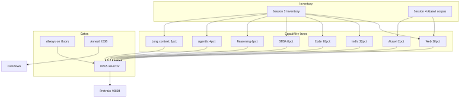
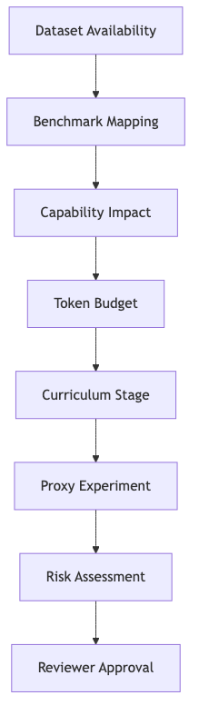
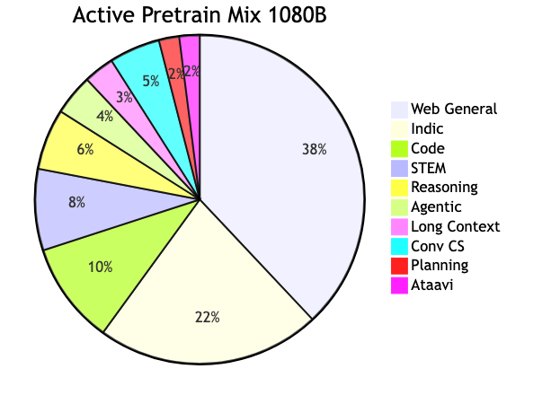
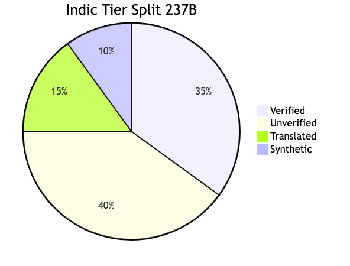
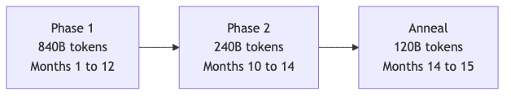

# ERA V5 Session 5 — Mixture & Curriculum Plan

**India-First 40B · Design Review**  
**Date:** 2026-08-01  
**Upstream:** [Session 3](../session3/) · [Session 4](../session4/)  
**Spec:** [`data/mixture_spec.json`](data/mixture_spec.json)  
**Run:** `python3 scripts/run_all.py` (must print 4/4 PASS)

> **Diagrams:** Render on GitHub via `assets/*.png` (committed in repo). Local browser gallery: **[diagrams.html](diagrams.html)**. Regenerate: `./scripts/render_diagrams.sh`

### Diagram gallery

**Mixture → training flow**



**Reviewer audit path**


**Decision validation pipeline**



**Capability budget (1080B)**



**Indic four-tier split**



**Curriculum timeline**



---

## 1. Executive Summary

This is the **1.2T-token pretraining mixture and curriculum** for the India-First 40B model.

| Commitment | Value |
|------------|-------|
| Total budget | 1,200B tokens |
| Active pretrain | 1,080B (90%) |
| Anneal reserve | 120B (10%) — locked until month 14 |
| Capability lanes | 10 — each mapped to benchmarks + datasets |
| Indic tiers | Verified 35% · Unverified 40% · Translated 15% · Synthetic 10% |
| Always-on floors | Indic 18% · Agentic 3% · CS 4% · Long-context 2% |
| Curriculum | 70% / 20% / 10% anneal |
| Proxy validation | **PASS** (scheduler proxy, both experiments) |

---

## 2. Assignment Traceability

| Requirement | Where | Evidence |
|-------------|-------|----------|
| Budget per capability slot | §6 | 10 lanes = 100% in `mixture_spec.json` |
| Indic tier split | §9 | Verified / unverified / translated / synthetic |
| Agentic, reasoning, long-context | §6 | Explicit lanes + datasets |
| Protected floor | §14 | `always_on_floor` in spec |
| Anneal reserve | §15 | 120B locked |
| Difficulty + reasoning bands | §11–12 | Examples per band |
| Proxy experiments | §17 | `experiments/results/*.json` |
| Cleaning for starved slots | §8 | `data/cleaning_manifest.json` |

---

## 3. Reviewer Journey


*Source:* [`assets/reviewer-journey.mmd`](assets/reviewer-journey.mmd)

**15-min audit:** Summary → §6 table → §9 Indic tiers → §8 supply gaps → §14 floors → `python3 scripts/run_all.py`.

---

## 4. Design Philosophy

1. **Benchmark-first** — Benchmark → Capability → Dataset → Curriculum → Training  
2. **No wishful accounting** — every `repeat_factor > 1` is declared  
3. **Data = hypothesis** — proxies before full 40B commit  
4. **Protected minorities** — Indic / agentic survive OPUS via floors  
5. **Agentic loss** — tool logs are context only; loss on assistant tokens  

---

## 5. Decision Validation Pipeline


*Source:* [`assets/dvp-pipeline.mmd`](assets/dvp-pipeline.mmd)

---

Every decision in [`docs/DDL.md`](docs/DDL.md) traces: Dataset → Benchmark → Capability → Budget → Curriculum → Proxy → Risk.

---

## 6. Capability Allocation


*Source:* [`assets/capability-flow.mmd`](assets/capability-flow.mmd)

**Active budget: 1,080B tokens**

| Lane | % | Tokens (B) | Benchmarks | Key datasets |
|------|--:|----------:|------------|--------------|
| Web & General NL | 38 | 410.4 | MMLU, TruthfulQA-IN | EN-IN web, wiki, **Ataavi S4** |
| **Indic Multilingual** | **22** | **237.6** | IndicGLUE, FLORES | MCDA web, gov, wiki, parallel, synth |
| Code | 10 | 108.0 | HumanEval+, SWE-bench | GitHub, SO, compile-gated synth |
| STEM | 8 | 86.4 | GSM8K, JEE | NCERT, arXiv, verified solutions |
| **Reasoning** | **6** | **64.8** | Gov/Edu 0.78 | RBI/GST/UPI, verified CoT |
| **Agentic** | **4** | **43.2** | Recovery ≥0.70 | Tool docs, sandbox traces |
| **Long Context** | **3** | **32.4** | Needle 32k/128k | Kanoon, contracts, multi-doc QA |
| Conversation & CS | 5 | 54.0 | CS Index ≥0.75 | Hinglish, BPO, tutor |
| Planning | 2 | 21.6 | Plan depth ≥5 steps | Workflow plans, repair pairs |
| Domain (Ataavi) | 2 | 21.6 | Species/habitat QA | Ataavi v0.4 + synth |


*Source:* [`assets/capability-pie.mmd`](assets/capability-pie.mmd)

---

## 7. Benchmark → Dataset Mapping

| Benchmark | Lane | Datasets |
|-----------|------|----------|
| IndicGLUE / FLORES | Indic | `mcda_web`, `gov_verified`, `wiki_indic` |
| Indic-Faithfulness ≥0.82 | Indic verified | `gov_verified`, `indic_synthetic` |
| HumanEval+ / SWE-bench | Code | `github_repos`, `issues_prs` |
| GSM8K / JEE | STEM + Reasoning | `ncert_math`, `cot_synthetic` |
| Gov/Edu 0.78 | Reasoning | `rbi_gst_upi`, `policy_qa` |
| Agent recovery 0.70 | Agentic | `agent_traces_pretrain` (+ 10B post-train ToolLoop) |
| Needle 32k/128k | Long Context | `kanoon_legal`, `multi_doc_qa` |
| CS Index 0.75 | Conversation/CS | `hinglish_social`, `bpo_support` |
| Species/habitat QA | Ataavi | `ataavi_corpus`, `ataavi_synthetic` |

---

## 8. Dataset Supply Analysis

| Lane | Budget (B) | Supply (B) | Repeat | Gap |
|------|----------:|----------:|-------:|-----|
| Web/General | 410.4 | ~385 | ~1× | Abundant |
| Indic | 237.6 | ~513 | mixed | Verified needs 6.9× — **cleaning sprint** |
| Code | 108.0 | ~494 | ~0.2× | Abundant |
| STEM | 86.4 | ~93 | ~0.9× | Abundant |
| Reasoning | 64.8 | ~16 | ~4× | **CoT verifier** — starved |
| Agentic | 43.2 | ~37 | ~1.2× | +10B post-train traces |
| Long Context | 32.4 | ~10 | 3–5× | Kanoon 4× repeat |
| Conv/CS | 54.0 | ~41 | ~1.3× | BPO backup if ToS risk |
| Planning | 21.6 | ~5 | ~2.5× | Human audit 8% |
| **Ataavi** | **21.6** | **~0.004** | **5400×** | **47M→120M obs (S4)** |

**Cleaning priority:** Ataavi, Reasoning, Long Context — see [`data/cleaning_manifest.json`](data/cleaning_manifest.json).

---

## 9. Indic Strategy

**22% = 237.6B tokens** (MCDA-sharpened, not census 39% Hindi)

| Tier | % | Tokens (B) | Example |
|------|--:|----------:|---------|
| **Verified** | 35 | 83.2 | NCERT hi/ta/te, RBI circulars |
| **Unverified** | 40 | 95.0 | MCDA web crawl, Wikipedia Indic |
| **Translated** | 15 | 35.6 | IndicTrans, NLLB parallel |
| **Synthetic** | 10 | 23.8 | Verifier-passed, 8% human audit |


*Source:* [`assets/indic-tier-pie.mmd`](assets/indic-tier-pie.mmd)

**MCDA weights (S3):** Hindi 17.9%, EN-IN 17.4%, Tamil 9.5%, Telugu 8.0%, Dravidian collective 28.4%.

---

## 10. Curriculum Timeline


*Source:* [`assets/curriculum-timeline.mmd`](assets/curriculum-timeline.mmd)

| Phase | Tokens (B) | Months | Emphasis |
|-------|----------:|--------|----------|
| Phase 1 | 840 | 1–12 | Web, broad Indic, code, STEM |
| Phase 2 | 240 | 10–14 | India-heavy, reasoning, agentic, LC ramp |
| Anneal | 120 | 14–15 | Verified Indic, HQ docs, LR decay |

20B-token linear ramp at each phase boundary.

---

## 11. Difficulty Bands

| Band | % | Example |
|------|--:|---------|
| D1 Recall | 30 | *Scientific name of Asian Koel?* |
| D2 Single-hop | 35 | *Purple Sunbird habitat in Western Ghats?* |
| D3 Multi-hop | 25 | *First migrant at Bharatpur given monsoon timing?* |
| D4 Adversarial | 10 | *Juvenile Indian Robin vs Magpie-Robin in poor light* |

---

## 12. Reasoning Bands

| Band | Tokens | % | Example |
|------|--------|--:|---------|
| R0 Fast | ≤64 | 40 | GST slab for ₹8.5L turnover |
| R1 Medium | 65–256 | 30 | EMI calculation, 4 steps |
| R2 High | 257–1024 | 20 | JEE projectile, bilingual derivation |
| R3 Ultra | 1025+ | 10 | Multi-doc RBI circular → NBFC LCR impact |

---

## 13. Context Length Evolution

| Stage | Seq len | Token range |
|-------|---------|-------------|
| P1 | 4k | 0–840B |
| P2 early | 8k | 840–960B |
| P2 mid | 16k | 960–1080B |
| P2 late + anneal | 32k | 1080–1200B |

Deploy: 128k RoPE extension post-pretrain (S3).

---

## 14. Always-On Floor

Selector **cannot** drop below:

| Lane | Floor |
|------|------:|
| Indic Multilingual | **18%** (194.4B) |
| Agentic | **3%** (32.4B) |
| Code-Switch | **4%** (43.2B) |
| Long Context | **2%** (21.6B) |

---

## 15. Annealing Reserve

| Parameter | Value |
|-----------|-------|
| Reserve | **120B (10%)** |
| Locked until | Month 14 |
| Mix | 50% verified Indic · 30% HQ docs · 20% STEM/reasoning verified |
| LR | WSD decay, final 5% at 0.1× peak |

Not available to active selector during P1/P2.

---

## 16. OPUS Strategy

- Utility = weighted per-lane benchmark delta proxy  
- Discard threshold: 0.15  
- Protected lanes: Indic, Agentic, CS, Long Context  
- Cannot breach §14 floors  

---

## 17. Proxy Experiments — EXECUTED

```bash
python3 scripts/run_all.py   # 4/4 PASS
```

| Experiment | Verdict | Key result |
|--------------|---------|------------|
| [proxy-1b](experiments/proxy-1b-two-phase.md) | **PASS** | Indic signal +2.99pp, code −1.54pp |
| [proxy-3b](experiments/proxy-3b-indic-floor.md) | **PASS** | Tail +4.52pp, needle 0.777 |

Results: [`experiments/results/`](experiments/results/)

Proxies validate **scheduler logic** (weights, floors, context ramp) — not full GPU 1B/3B training.

---

## 18. FMEA

Top risks: [`docs/FMEA.md`](docs/FMEA.md)

| Priority | Risk | Mitigation |
|----------|------|------------|
| P0 | Indic tail collapse | Floor 18% + Phase-2 boost |
| P0 | Synthetic >8% | Global cap 6% |
| P0 | Benchmark contamination | S4 13-gram decontam |
| P1 | Ataavi 5400× repeat | Cleaning sprint to 120M obs |

---

## 19–20. ADRs & DDL

| Doc | Contents |
|-----|----------|
| [ADR-001](docs/ADR-001-capability-allocation.md) | Lane allocation |
| [ADR-002](docs/ADR-002-curriculum.md) | Two-phase + anneal |
| [ADR-003](docs/ADR-003-indic-tiers.md) | Four-tier Indic split |
| [ADR-004](docs/ADR-004-always-on-opus.md) | Floors + OPUS |
| [DDL](docs/DDL.md) | 26 traced decisions |
| [FMEA](docs/FMEA.md) | Failure modes |
| [Reviewer sim](docs/REVIEWER_SIMULATION.md) | 48 challenge Q&As |

---

## 21. Reviewer Checklist

- [x] `python3 scripts/run_all.py` → 4/4 PASS
- [x] Lanes sum to 100% / 1,080B
- [x] Indic tiers sum to 100% / 237.6B
- [x] Every lane has benchmark + dataset
- [x] Supply gaps declared
- [x] Floors ≤ lane allocations
- [x] Anneal 120B separate
- [x] Proxies executed
- [x] Cleaning manifest for starved lanes

---

## 22. Final Specification

```json
{
  "total_tokens_b": 1200,
  "active_pretrain_b": 1080,
  "anneal_reserve_b": 120,
  "lanes": "web 38 | indic 22 | code 10 | stem 8 | reasoning 6 | agentic 4 | lc 3 | cs 5 | plan 2 | ataavi 2",
  "indic_tiers": "verified 35 | unverified 40 | translated 15 | synthetic 10",
  "floors": "indic 18 | agentic 3 | cs 4 | lc 2",
  "curriculum": "70% P1 | 20% P2 | 10% anneal"
}
```

---

## Quick Start

```bash
cd session5
python3 scripts/run_all.py
```

## Repo Layout

```
session5/
├── README.md              ← main submission (diagrams embedded)
├── diagrams.html          ← open in browser if preview fails
├── data/
│   ├── mixture_spec.json
│   └── cleaning_manifest.json
├── docs/                  ADR, DDL, FMEA, reviewer simulation
├── experiments/           specs + results/
├── scripts/               validate, proxies, run_all
└── assets/                .mmd sources + .png / .svg diagrams
```

---

*A mixture is only as trustworthy as the cleaned tokens behind it.*
