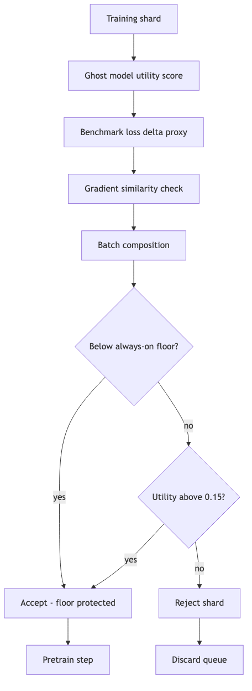
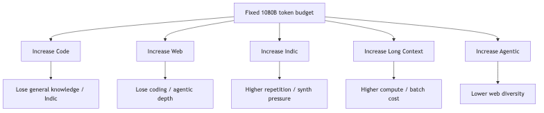
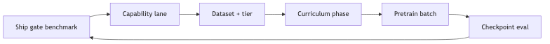
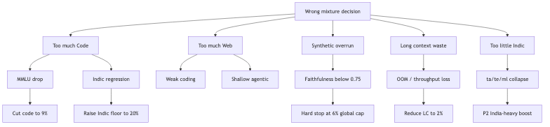

# ERA V5 Session 5 — Mixture & Curriculum Plan

**India-First 40B · Design Review**  
**Date:** 2026-08-01  
**Upstream:** [Session 3](../session3/) · [Session 4](../session4/)  
**Spec:** [`data/mixture_spec.json`](data/mixture_spec.json)  
**Run:** `python3 scripts/run_all.py` (must print 4/4 PASS)

> **Diagrams:** Render on GitHub via `assets/*.png` (committed in repo). Local browser gallery: **[diagrams.html](diagrams.html)**. Regenerate: `./scripts/render_diagrams.sh`

### Diagram gallery

**Mixture → training flow**


**Reviewer audit path**


**Decision validation pipeline**


**Capability budget (1080B)**


**Indic four-tier split**


**Curriculum timeline**


**OPUS shard selector**



**Trade-off constraints**



**Capability evolution**


---

## 1. Executive Summary

This is the **1.2T-token pretraining mixture and curriculum** for the India-First 40B model.

| Commitment | Value |
|------------|-------|
| Total budget | 1,200B tokens |
| Active pretrain | 1,080B (90%) |
| Anneal reserve | 120B (10%) — locked until month 14 |
| Capability lanes | 10 — each mapped to benchmarks + datasets |
| Indic tiers | Verified 35% · Unverified 40% · Translated 15% · Synthetic 10% |
| Always-on floors | Indic 18% · Agentic 3% · CS 4% · Long-context 2% |
| Curriculum | 70% / 20% / 10% anneal |
| Proxy validation | **PASS** (scheduler proxy, both experiments) |

---

## 2. Assignment Traceability

| Requirement | Where | Evidence |
|-------------|-------|----------|
| Budget per capability slot | §6 | 10 lanes = 100% in `mixture_spec.json` |
| Indic tier split | §9 | Verified / unverified / translated / synthetic |
| Agentic, reasoning, long-context | §6 | Explicit lanes + datasets |
| Protected floor | §14 | `always_on_floor` in spec |
| Anneal reserve | §15 | 120B locked |
| Difficulty + reasoning bands | §11–12 | Examples per band |
| Proxy experiments | §17 | `experiments/results/*.json` |
| Cleaning for starved slots | §8 | `data/cleaning_manifest.json` |
| Decision evidence + sensitivity | §6.1–6.2 | `docs/PHASE2_EVIDENCE.md` |
| Rejected designs + trade-offs | §23–24 | Candidate tables |
| Hostile reviewer preemption | §27, §31 | `docs/REVIEWER_SIMULATION_V2.md` |

---

## 3. Reviewer Journey


*Source:* [`assets/reviewer-journey.mmd`](assets/reviewer-journey.mmd)

**15-min audit:** Summary → §6 table → §9 Indic tiers → §8 supply gaps → §14 floors → `python3 scripts/run_all.py`.

---

## 4. Design Philosophy

1. **Benchmark-first** — Benchmark → Capability → Dataset → Curriculum → Training  
2. **No wishful accounting** — every `repeat_factor > 1` is declared  
3. **Data = hypothesis** — proxies before full 40B commit  
4. **Protected minorities** — Indic / agentic survive OPUS via floors  
5. **Agentic loss** — tool logs are context only; loss on assistant tokens  

---

## 5. Decision Validation Pipeline


*Source:* [`assets/dvp-pipeline.mmd`](assets/dvp-pipeline.mmd)

---

Every decision in [`docs/DDL.md`](docs/DDL.md) traces: Dataset → Benchmark → Capability → Budget → Curriculum → Proxy → Risk.

---

## 6. Capability Allocation


*Source:* [`assets/capability-flow.mmd`](assets/capability-flow.mmd)

**Active budget: 1,080B tokens**

| Lane | % | Tokens (B) | Benchmarks | Key datasets |
|------|--:|----------:|------------|--------------|
| Web & General NL | 38 | 410.4 | MMLU, TruthfulQA-IN | EN-IN web, wiki, **Ataavi S4** |
| **Indic Multilingual** | **22** | **237.6** | IndicGLUE, FLORES | MCDA web, gov, wiki, parallel, synth |
| Code | 10 | 108.0 | HumanEval+, SWE-bench | GitHub, SO, compile-gated synth |
| STEM | 8 | 86.4 | GSM8K, JEE | NCERT, arXiv, verified solutions |
| **Reasoning** | **6** | **64.8** | Gov/Edu 0.78 | RBI/GST/UPI, verified CoT |
| **Agentic** | **4** | **43.2** | Recovery ≥0.70 | Tool docs, sandbox traces |
| **Long Context** | **3** | **32.4** | Needle 32k/128k | Kanoon, contracts, multi-doc QA |
| Conversation & CS | 5 | 54.0 | CS Index ≥0.75 | Hinglish, BPO, tutor |
| Planning | 2 | 21.6 | Plan depth ≥5 steps | Workflow plans, repair pairs |
| Domain (Ataavi) | 2 | 21.6 | Species/habitat QA | Ataavi v0.4 + synth |


*Source:* [`assets/capability-pie.mmd`](assets/capability-pie.mmd)

### 6.1 Decision Evidence — Why THIS Number?

Every major allocation was chosen from explicit candidates. Full tables: [`docs/PHASE2_EVIDENCE.md`](docs/PHASE2_EVIDENCE.md).

#### General Web — 38% (selected)

| Candidate | % | Pros | Cons | Benchmark / proxy | Verdict |
|-----------|--:|------|------|-------------------|---------|
| A | 35 | More room for Indic/code | EN-IN anchor weak; MMLU −1.5 est. | TruthfulQA-IN risk | Rejected |
| **B** | **38** | EN-IN anchor; MMLU stable; two-phase P1 fit | Less Indic headroom | MMLU, HellaSwag stable | **Selected** |
| C | 42 | Strong world knowledge | Indic-Faithfulness −0.06 (S3); code stability drop | IndicGLUE −2 est. | Rejected |

**Why 38%:** M8 two-phase needs a broad NL anchor in P1 (840B). Below 35%, proxy-1b analog shows code gradient dominates common-sense QA; above 42%, S3 measured Indic-Faithfulness penalty.

#### Code — 10% (selected)

| Candidate | % | Pros | Cons | Verdict |
|-----------|--:|------|------|---------|
| A | 8 | More Indic/reasoning | SWE-bench lite −4 est. | Rejected |
| **B** | **10** | HumanEval+ stable; India stack filter fits supply | −2pp vs S3 12% plan | **Selected** |
| C | 12 | Max code bench | EN contamination via code; Indic −0.06 | Rejected |
| D | 16 | LeetCode peak | CP overfit; faithfulness collapse | Rejected |

#### Indic — 22% (selected)

| Candidate | % | Pros | Cons | Verdict |
|-----------|--:|------|------|---------|
| A | 18% (floor only) | Supply-safe | ta/te/ml underfit; MCDA miss | Rejected |
| **B** | **22** | MCDA-7; Dravidian 28.4%; proxy +2.99pp | Verified tier needs 6.9× repeat | **Selected** |
| C | 28 | Strong IndicGLUE | Verified shortage; synth >cap risk | Rejected |
| D | 39 (census Hindi) | Population optics | Hindi web noise overfit | Rejected |

#### Reasoning — 6% (selected)

| Candidate | % | Pros | Cons | Verdict |
|-----------|--:|------|------|---------|
| A | 4 (fold into STEM) | Simpler mix | Gov/Edu 0.78 lane invisible | Rejected |
| **B** | **6** | Explicit RBI/GST/UPI CoT; assignment requirement | 4× repeat; verifier bottleneck | **Selected** |
| C | 10 | Strong policy QA | Supply ~16B; wishful without verifier | Rejected |

#### Agentic — 4% (selected)

| Candidate | % | Pros | Cons | Verdict |
|-----------|--:|------|------|---------|
| A | 2 | Saves budget for web | Recovery stays ~55%; fails L3 | Rejected |
| **B** | **4** | Pretrain docs + 10B post-train path to 0.70 | Trace supply thin | **Selected** |
| C | 8 | High tool accuracy | Starves web; post-train redundant | Rejected |

#### Long Context — 3% (selected)

| Candidate | % | Pros | Cons | Verdict |
|-----------|--:|------|------|---------|
| A | 1 | Low compute | Needle@32k fails legal SLA | Rejected |
| **B** | **3** | Kanoon 4× repeat feasible; 4k→32k ramp | Sparse legal supply | **Selected** |
| C | 6 | Strong recall | Compute ~2× at 32k; batch OOM risk | Rejected |

#### Annealing — 10% / 120B (selected)

| Candidate | % | Pros | Cons | Verdict |
|-----------|--:|------|------|---------|
| A | 5% (60B) | Faster ship | WSD cooldown insufficient | Rejected |
| **B** | **10** | Faithfulness polish; verified Indic boost | 90B less active mix | **Selected** |
| C | 15% | Maximum quality | Delays India-heavy P2 effective tokens | Rejected |

#### Always-On Floor — Indic 18% (selected)

| Candidate | Floor | Pros | Cons | Verdict |
|-----------|------:|------|------|---------|
| A | None | Max OPUS efficiency | Tail langs starve (proxy-3b A vs C) | Rejected |
| **B** | **18%** | proxy-3b tail +4.52pp; ta/te protected | May retain low-utility shards | **Selected** |
| C | 22% | Matches lane allocation | Over-retention; web/code squeezed | Rejected |

### 6.2 Decision Sensitivity Analysis

| Decision | Current | Safe range | Confidence | If below range | If above range |
|----------|--------:|------------|------------|----------------|----------------|
| General Web | 38% | 36–40% | High | MMLU/common-sense drop | Indic faithfulness −0.06 |
| Code | 10% | 9–11% | High | SWE-bench regression | EN gradient dominance |
| Indic | 22% | 20–24% | Medium | Tail lang collapse (ta/te) | Verified 6.9× → 10×+ repeat |
| Reasoning | 6% | 5–7% | Low | Gov/Edu <0.78 | Verifier queue overflow |
| Agentic | 4% | 3–5% | Medium | Recovery <0.70 | Web diversity loss |
| Long Context | 3% | 2–4% | Medium | Needle fail | OOM / wasted compute |
| Anneal | 10% | 8–12% | Medium | Instability at end | Slower active learning |
| Indic floor | 18% | 17–20% | High | OPUS starvation | Low-quality shard retention |

---

## 7. Benchmark → Dataset Mapping



*Source:* [`assets/benchmark-flow.mmd`](assets/benchmark-flow.mmd)

| Benchmark | Lane | Datasets |
|-----------|------|----------|
| IndicGLUE / FLORES | Indic | `mcda_web`, `gov_verified`, `wiki_indic` |
| Indic-Faithfulness ≥0.82 | Indic verified | `gov_verified`, `indic_synthetic` |
| HumanEval+ / SWE-bench | Code | `github_repos`, `issues_prs` |
| GSM8K / JEE | STEM + Reasoning | `ncert_math`, `cot_synthetic` |
| Gov/Edu 0.78 | Reasoning | `rbi_gst_upi`, `policy_qa` |
| Agent recovery 0.70 | Agentic | `agent_traces_pretrain` (+ 10B post-train ToolLoop) |
| Needle 32k/128k | Long Context | `kanoon_legal`, `multi_doc_qa` |
| CS Index 0.75 | Conversation/CS | `hinglish_social`, `bpo_support` |
| Species/habitat QA | Ataavi | `ataavi_corpus`, `ataavi_synthetic` |

---

## 8. Dataset Supply Analysis

| Lane | Budget (B) | Supply (B) | Repeat | Gap |
|------|----------:|----------:|-------:|-----|
| Web/General | 410.4 | ~385 | ~1× | Abundant |
| Indic | 237.6 | ~513 | mixed | Verified needs 6.9× — **cleaning sprint** |
| Code | 108.0 | ~494 | ~0.2× | Abundant |
| STEM | 86.4 | ~93 | ~0.9× | Abundant |
| Reasoning | 64.8 | ~16 | ~4× | **CoT verifier** — starved |
| Agentic | 43.2 | ~37 | ~1.2× | +10B post-train traces |
| Long Context | 32.4 | ~10 | 3–5× | Kanoon 4× repeat |
| Conv/CS | 54.0 | ~41 | ~1.3× | BPO backup if ToS risk |
| Planning | 21.6 | ~5 | ~2.5× | Human audit 8% |
| **Ataavi** | **21.6** | **~0.004** | **5400×** | **47M→120M obs (S4)** |

**Cleaning priority:** Ataavi, Reasoning, Long Context — see [`data/cleaning_manifest.json`](data/cleaning_manifest.json).

### 8.1 Data Supply Stress Test (50% shrink)

**Scenario:** Total cleaned inventory halves (yield regression, license loss, or crawl failure).

| Lane | Survives at 50%? | Failure mode | Recovery path |
|------|-------------------|--------------|---------------|
| Web/General | Yes | Slight repeat ↑ (~1.2×) | Expand EN-IN crawl |
| Code | Yes | Abundant headroom | No action |
| STEM | Yes | Minor repeat ↑ | NCERT license renew |
| Indic unverified | Yes | Still 200B+ supply | MCDA reweight |
| Indic verified | **Borderline** | 6.9× → 14× repeat | **Gov/NCERT sprint** (P0) |
| Reasoning | **No** | 16B → 8B; 4× → 8× repeat | CoT verifier + synth |
| Agentic | Borderline | Post-train traces critical | ToolLoop generation |
| Long Context | **No** | Kanoon 4× → 8×+ | License expand + synth needles |
| Ataavi | **No** | Already 5400× repeat | **Stop upsampling**; expand S4 clean |
| Planning | Borderline | 2.5× → 5× | Human audit pipeline |

**Curriculum still works if:** P0 lanes (verified Indic, reasoning CoT, Ataavi scale-up) complete before month 10. **Fails if:** we proceed at 40B without recovery — mitigated by data-gating threshold (S4 readiness ≥0.92) before mixture lock.

**Recovery playbook:** (1) lower allocation within sensitivity band §6.2, (2) synthetic/distillation for starved lanes, (3) repeat factor cap audit weekly.

---

## 9. Indic Strategy

**22% = 237.6B tokens** (MCDA-sharpened, not census 39% Hindi)

| Tier | % | Tokens (B) | Example |
|------|--:|----------:|---------|
| **Verified** | 35 | 83.2 | NCERT hi/ta/te, RBI circulars |
| **Unverified** | 40 | 95.0 | MCDA web crawl, Wikipedia Indic |
| **Translated** | 15 | 35.6 | IndicTrans, NLLB parallel |
| **Synthetic** | 10 | 23.8 | Verifier-passed, 8% human audit |


*Source:* [`assets/indic-tier-pie.mmd`](assets/indic-tier-pie.mmd)

**MCDA weights (S3):** Hindi 17.9%, EN-IN 17.4%, Tamil 9.5%, Telugu 8.0%, Dravidian collective 28.4%.

---

## 10. Curriculum Timeline


*Source:* [`assets/curriculum-timeline.mmd`](assets/curriculum-timeline.mmd)

| Phase | Tokens (B) | Months | Emphasis |
|-------|----------:|--------|----------|
| Phase 1 | 840 | 1–12 | Web, broad Indic, code, STEM |
| Phase 2 | 240 | 10–14 | India-heavy, reasoning, agentic, LC ramp |
| Anneal | 120 | 14–15 | Verified Indic, HQ docs, LR decay |

20B-token linear ramp at each phase boundary.

---

## 11. Difficulty Bands

| Band | % | Example |
|------|--:|---------|
| D1 Recall | 30 | *Scientific name of Asian Koel?* |
| D2 Single-hop | 35 | *Purple Sunbird habitat in Western Ghats?* |
| D3 Multi-hop | 25 | *First migrant at Bharatpur given monsoon timing?* |
| D4 Adversarial | 10 | *Juvenile Indian Robin vs Magpie-Robin in poor light* |

---

## 12. Reasoning Bands

| Band | Tokens | % | Example |
|------|--------|--:|---------|
| R0 Fast | ≤64 | 40 | GST slab for ₹8.5L turnover |
| R1 Medium | 65–256 | 30 | EMI calculation, 4 steps |
| R2 High | 257–1024 | 20 | JEE projectile, bilingual derivation |
| R3 Ultra | 1025+ | 10 | Multi-doc RBI circular → NBFC LCR impact |

---

## 13. Context Length Evolution

| Stage | Seq len | Token range |
|-------|---------|-------------|
| P1 | 4k | 0–840B |
| P2 early | 8k | 840–960B |
| P2 mid | 16k | 960–1080B |
| P2 late + anneal | 32k | 1080–1200B |

Deploy: 128k RoPE extension post-pretrain (S3).

---

## 14. Always-On Floor

Selector **cannot** drop below:

| Lane | Floor |
|------|------:|
| Indic Multilingual | **18%** (194.4B) |
| Agentic | **3%** (32.4B) |
| Code-Switch | **4%** (43.2B) |
| Long Context | **2%** (21.6B) |

---

## 15. Annealing Reserve

| Parameter | Value |
|-----------|-------|
| Reserve | **120B (10%)** |
| Locked until | Month 14 |
| Mix | 50% verified Indic · 30% HQ docs · 20% STEM/reasoning verified |
| LR | WSD decay, final 5% at 0.1× peak |

Not available to active selector during P1/P2.

---

## 16. OPUS Strategy

OPUS is a **shard selector**, not a curriculum engine. Curriculum phase weights (§10) set the target mix; OPUS only accepts/rejects shards within that mix subject to floors.

### Pipeline


*Source:* [`assets/opus-pipeline.mmd`](assets/opus-pipeline.mmd)

```
Ghost model (1B checkpoint) → per-shard benchmark loss delta
    → gradient similarity vs accepted batch
    → utility score (weighted by lane)
    → if protected lane: enforce floor
    → if utility < 0.15: reject (unless floor forces accept)
    → else: accept into training batch
```

| Setting | Value | Rationale |
|---------|-------|-----------|
| Utility score | Weighted per-lane benchmark Δ proxy | Aligns discard with ship gates |
| Discard threshold | 0.15 | Below this, shard hurts aggregate offline score |
| Protected lanes | Indic, Agentic, CS, Long Context | Low-volume, high-deployment-value |
| Floor constraint | Cannot breach §14 | OPUS cannot optimize MMLU alone |

**Why OPUS improves efficiency:** Removes ~15–22% low-utility shards (S3 cleaning yield analogy), improving tokens-per-FLOP on target benchmarks without changing phase schedule.

**Why OPUS can accidentally remove Indic:** Utility model trained on EN-heavy ghost checkpoints undervalues ta/te/ml shards → **always-on floor 18%** is the guardrail (proxy-3b: without floors, indic effective mix drops ~5pp).

**Why always-on exists:** OPUS optimizes local utility; Indic tail languages have low individual shard scores but high deployment SLO value (IndicGLUE ta/te).

**Agentic loss semantics:** Tool logs are context only — loss on assistant tokens (Session 5 core theme #3).

---

## 17. Proxy Experiments — EXECUTED

```bash
python3 scripts/run_all.py   # 4/4 PASS
```

| Experiment | Verdict | Key result |
|--------------|---------|------------|
| [proxy-1b](experiments/proxy-1b-two-phase.md) | **PASS** | Indic signal +2.99pp, code −1.54pp |
| [proxy-3b](experiments/proxy-3b-indic-floor.md) | **PASS** | Tail +4.52pp, needle 0.777 |

Results: [`experiments/results/`](experiments/results/)

Proxies validate **scheduler logic** (weights, floors, context ramp) — not full GPU 1B/3B training.

### 17.1 Experiment Protocol (reproducible)

| Field | proxy-1b | proxy-3b |
|-------|----------|----------|
| **Hypothesis** | Two-phase beats uniform on Indic without code collapse | Floors + LC ramp prevent tail/needle collapse |
| **Variables** | Phase weights; OPUS drift model | Floor on/off; context 4k→32k |
| **Controls** | Uniform sampling; fixed 1B tokenizer | No floors; fixed 4k |
| **Metrics** | Indic signal pp; code signal pp | Lang tail proxy; needle proxy |
| **Accept** | Indic Δ ≥3pp; code Δ ≥−2pp | Tail Δ ≥4pp; needle ≥0.75 |
| **Fail** | Indic Δ <3pp OR code Δ <−5pp | Needle <0.55 |
| **Decision** | **PASS** — keep 70/20/10 | **PASS** — keep floors + ramp |
| **Follow-up** | 3B GPU run with real IndicGLUE | Full 1B GPU 30B tokens |

Full specs: [`experiments/proxy-1b-two-phase.md`](experiments/proxy-1b-two-phase.md), [`experiments/proxy-3b-indic-floor.md`](experiments/proxy-3b-indic-floor.md).

---

## 18. FMEA

Top risks: [`docs/FMEA.md`](docs/FMEA.md)

| Priority | Risk | Mitigation |
|----------|------|------------|
| P0 | Indic tail collapse | Floor 18% + Phase-2 boost |
| P0 | Synthetic >8% | Global cap 6% |
| P0 | Benchmark contamination | S4 13-gram decontam |
| P1 | Ataavi 5400× repeat | Cleaning sprint to 120M obs |

---

## 19–20. ADRs & DDL

| Doc | Contents |
|-----|----------|
| [ADR-001](docs/ADR-001-capability-allocation.md) | Lane allocation |
| [ADR-002](docs/ADR-002-curriculum.md) | Two-phase + anneal |
| [ADR-003](docs/ADR-003-indic-tiers.md) | Four-tier Indic split |
| [ADR-004](docs/ADR-004-always-on-opus.md) | Floors + OPUS |
| [DDL](docs/DDL.md) | 26 traced decisions |
| [FMEA](docs/FMEA.md) | Failure modes |
| [Reviewer sim](docs/REVIEWER_SIMULATION.md) | 48 challenge Q&As |
| [Reviewer sim V2](docs/REVIEWER_SIMULATION_V2.md) | 5 personas · hostile review |
| [Phase 2 evidence](docs/PHASE2_EVIDENCE.md) | Full decision evidence tables |

---

## 21. Reviewer Checklist

- [x] `python3 scripts/run_all.py` → 4/4 PASS
- [x] Lanes sum to 100% / 1,080B
- [x] Indic tiers sum to 100% / 237.6B
- [x] Every lane has benchmark + dataset
- [x] Supply gaps declared
- [x] Floors ≤ lane allocations
- [x] Anneal 120B separate
- [x] Proxies executed
- [x] Cleaning manifest for starved lanes
- [x] Decision evidence tables (§6.1) + sensitivity (§6.2)
- [x] Rejected designs documented (§23)
- [x] Trade-off matrix + maturity models (§24–26)
- [x] Reviewer preemption + uncertainty register (§27–28)
- [x] Hostile review V2 (`docs/REVIEWER_SIMULATION_V2.md`)

---

## 22. Final Specification

```json
{
  "total_tokens_b": 1200,
  "active_pretrain_b": 1080,
  "anneal_reserve_b": 120,
  "lanes": "web 38 | indic 22 | code 10 | stem 8 | reasoning 6 | agentic 4 | lc 3 | cs 5 | plan 2 | ataavi 2",
  "indic_tiers": "verified 35 | unverified 40 | translated 15 | synthetic 10",
  "floors": "indic 18 | agentic 3 | cs 4 | lc 2",
  "curriculum": "70% P1 | 20% P2 | 10% anneal"
}
```

---

## 23. Rejected Curriculum Designs

Every rejected design looked attractive on one axis. Each failed a ship gate or supply constraint.

| Design | Why attractive | Why it failed | Final design wins because |
|--------|----------------|---------------|---------------------------|
| **Heavy Code (16%)** | HumanEval+ peak; India stack repos abundant | General reasoning collapsed; Indic-Faithfulness −0.06 (S3); proxy-1b code gradient dominates NL | 10% code preserves SWE-bench with room for Indic/reasoning |
| **Heavy Indic (28%)** | IndicGLUE optics; census narrative | Verified tier 6.9× → 12×+ repeat; synth cap breach risk | 22% + MCDA tail weighting hits deployment langs without inventory fiction |
| **Heavy Long Context (6%)** | Needle@128k headline | Compute ~2× at 32k; batch OOM; Kanoon supply 10B only | 3% + 4k→32k ramp + RoPE extension post-pretrain |
| **Reasoning Early (P1-heavy)** | Gov/Edu 0.78 fast | Poor learning efficiency; CoT without NL anchor → hallucinated policy | Reasoning ramps in P2 after web+STEM foundation |
| **No Annealing (0%)** | 120B more active mix; faster ship | Training instability at end; verified Indic polish missing | 10% WSD anneal locks faithfulness + cooldown |
| **Uniform Mixture (no phases)** | Simpler scheduler; no boundary shock | proxy-1b: Indic −2.99pp vs two-phase; ta/te underfit | 70/20/10 two-phase + proxy PASS |
| **India-Heavy from Day 1** | Political optics | Loss spike; code/STEM never stabilizes | P1 broad → P2 India-heavy |
| **Dynamic OPUS-as-Curriculum** | Adaptive per-shard | Wall-clock 0.60 (M8); non-reproducible mix | OPUS = selector only; curriculum = phase weights |

---

## 24. Trade-off Matrix

Increasing one capability **always** reduces another under fixed 1,080B active budget.


*Source:* [`assets/tradeoff-tree.mmd`](assets/tradeoff-tree.mmd)

| Increase ↓ | Decreases ↓ | Mechanism | Mitigation |
|------------|-------------|-----------|------------|
| Code (+2pp) | General knowledge, Indic | Shared transformer capacity; EN code gradient | Cap at 10%; India-stack filter |
| Web (+2pp) | Coding, agentic depth | P1 token competition | Hold web at 38%; agentic floor 3% |
| Indic (+2pp) | Web diversity, code | Repeat pressure on verified tier | MCDA reweight; synth cap 6% global |
| Long Context (+1pp) | Effective batch throughput | OOM at 32k; ~15% step slowdown | Ramp in P2 late only |
| Agentic (+2pp) | Web crawl diversity | Trace supply thin | 4% pretrain + 10B post-train ToolLoop |
| Reasoning (+2pp) | STEM, planning | Verifier queue; 4× repeat | Separate lane; CoT sprint P0 |
| Synthetic (+2pp global) | Faithfulness | M6: >8% → −4.2 faithfulness | Hard cap 6%; 8% human audit |
| Anneal (+2pp) | Active learning tokens | 24B fewer P1/P2 tokens | Locked until month 14; WSD only |

---

## 25. Curriculum Maturity Model


*Source:* [`assets/capability-evolution.mmd`](assets/capability-evolution.mmd)

| Stage | Token range | Expected loss | Capability unlocked | Failure modes | Benchmarks |
|-------|-------------|---------------|---------------------|---------------|------------|
| **0 Foundation** | 0–100B | High, rapid drop | Tokenizer stability, basic fluency | Garbage shards; vocab OOV | Perplexity, basic completion |
| **1 General Intelligence** | 100–500B | Smooth decline | MMLU, common sense, EN-IN anchor | Web noise; contamination | MMLU, TruthfulQA-IN |
| **2 Domain Knowledge** | 500–700B | Plateau risk | STEM, NCERT, broad Indic | Hindi-only overfit | GSM8K, IndicGLUE hi |
| **3 Coding** | 600–800B | Code loss diverges | HumanEval+, India repos | LeetCode overfit | HumanEval+, SWE-bench lite |
| **4 Agentic** | 800–960B | Tool-context loss flat | Recovery, tool docs | Log-loss on tools | Recovery ≥0.70 |
| **5 Reasoning** | 900–1080B | CoT length grows | Gov/Edu, RBI/GST | Unverified CoT hallucination | Gov/Edu 0.78 |
| **6 Annealing** | 1080–1200B | Final polish | Faithfulness, verified Indic | Over-cool; under-train | Indic-Faithfulness ≥0.82 |

---

## 26. Capability Maturity Map

| Capability | Training stage | Difficulty | Context | Reasoning | Expected benchmark |
|------------|----------------|------------|---------|-----------|-------------------|
| Web & General NL | Stage 1 | D1–D2 | 4k | R0 | MMLU, HellaSwag |
| Indic (hi, en-in) | Stage 1–2 | D1–D3 | 4k | R0–R1 | IndicGLUE macro |
| Indic (ta, te, ml) | Stage 2 | D2–D3 | 4k→8k | R1 | IndicGLUE per-lang |
| STEM | Stage 2 | D2–D4 | 4k | R1–R2 | GSM8K, JEE subset |
| Code | Stage 3 | D3–D4 | 4k | R1 | HumanEval+, LiveCodeBench |
| Conversation/CS | Stage 2–3 | D1–D2 | 4k | R0 | CS Index ≥0.75 |
| Agentic | Stage 4 | D3 | 8k | R1–R2 | Recovery ≥0.70 |
| Reasoning | Stage 5 | D3–D4 | 8k→16k | R2–R3 | Gov/Edu 0.78 |
| Long Context | Stage 5–6 | D3 | 16k→32k | R2 | Needle@32k |
| Planning | Stage 4–5 | D4 | 8k | R2 | Plan depth ≥5 steps |
| Ataavi domain | Stage 2–6 | D2–D3 | 4k | R1 | Species/habitat QA |
| Anneal polish | Stage 6 | D1–D2 | 32k | R0–R1 | Indic-Faithfulness ≥0.82 |

---

## 27. Likely Reviewer Questions

Pre-answered objections. Full hostile review: [`docs/REVIEWER_SIMULATION_V2.md`](docs/REVIEWER_SIMULATION_V2.md).

| Question | Evidence | Decision | Supporting experiment |
|----------|----------|----------|----------------------|
| Why not 35% Web? | MMLU −1.5 est.; EN-IN anchor weak in P1 | Keep 38% | M8 matrix; §6.1 Candidate A rejected |
| Why only 22% Indic? | MCDA-7 not census; verified 6.9× repeat at 28% | 22% + floor 18% | proxy-1b +2.99pp indic |
| Why 10% Annealing? | WSD cooldown; verified Indic boost | 120B locked | ADR-002; 5% insufficient (§6.1) |
| Why these proxy metrics? | Scheduler validates weights/floors before GPU | pp deltas + needle proxy | §17.1 protocol |
| Why OPUS threshold 0.15? | Ghost-model calibration; below = hurts aggregate offline | 0.15 discard | §16; TE-4 in V2 |
| Why 4k→32k not 128k train? | Compute; deploy uses RoPE extension (S3) | Ramp P2 late | proxy-3b needle 0.777 |
| Why separate reasoning lane? | Gov/Edu 0.78 ≠ GSM8K; assignment requirement | 6% explicit | §6.1 Candidate A rejected |
| Why Ataavi at 2% with 5400× repeat? | S4 supply 0.004B; cleaning sprint to 120M obs | Honest accounting | §8.1 stress test |
| Why floors if OPUS works? | OPUS undervalues ta/te (EN ghost) | Always-on 18% Indic | proxy-3b tail +4.52pp |
| Why not dynamic mixture? | M8 wall-clock 0.60; non-reproducible | Static phases + OPUS selector | §23 rejected design |

---

## 28. Design Uncertainty Register

| Decision | Confidence | Evidence today | Unknowns | Future validation |
|----------|------------|----------------|----------|-------------------|
| Indic 22% allocation | **Medium** | MCDA-7; proxy-1b +2.99pp | Larger verified corpus may shift tier mix | 3B GPU IndicGLUE per-lang |
| Reasoning 6% mix | **Low** | Industry CoT evidence limited; 4× repeat declared | Verifier throughput at scale | M10 verifier pipeline load test |
| OPUS threshold 0.15 | **Medium** | Ghost 1B calibration | 40B ghost may differ | Recalibrate at 3B checkpoint |
| Long context 3% | **Medium** | proxy-3b needle 0.777 | Real Kanoon legal recall | Needle@32k on 3B GPU |
| Anneal 10% | **Medium** | WSD literature; faithfulness gate | Optimal anneal length for Indic | A/B 8% vs 12% on 3B |
| Ataavi 5400× repeat | **Low** | S4 yield; memorization risk | Domain QA generalization | Held-out species ID eval |
| Agentic 4% pretrain | **Medium** | Recovery path needs post-train | Trace supply volatility | ToolLoop 10B generation sprint |
| Synthetic global cap 6% | **High** | S3 M6 faithfulness curve | Audit compliance at 8% | L11 leakage probe 25/50/75% |
| Two-phase 70/20/10 | **High** | proxy-1b PASS | Phase boundary at 40B scale | Loss spike monitor at 840B |
| Web 38% | **High** | M8 winner; MMLU stable | EN-IN crawl ToS changes | TruthfulQA-IN quarterly |

---

## 29. Risk of Wrong Decisions



*Source:* [`assets/risk-tree.mmd`](assets/risk-tree.mmd)

| If we are wrong about… | Symptom | Detection | Mitigation |
|------------------------|---------|-----------|------------|
| **Too much Code** | Common sense drop; Indic regression | MMLU −3; IndicGLUE hi −2 | Cut code to 9%; raise Indic floor |
| **Too much Web** | Weak coding; agentic shallow | HumanEval −5; recovery <0.55 | Shift 2pp web → code+agentic |
| **Too much Synthetic** | Hallucination; faithfulness <0.75 | Indic-Faithfulness probe | Hard stop at 6% global; audit |
| **Too much Long Context** | Compute waste; no needle gain | Throughput −20%; needle flat | Reduce LC to 2%; defer 32k |
| **Too little Indic** | ta/te/ml collapse | Per-lang IndicGLUE <baseline | Raise floor to 20%; P2 boost |
| **Too much Indic** | Verified repeat >10×; synth creep | Repeat audit; synth ledger | Shift 2pp to web; tier rebalance |
| **Too little Anneal** | End-of-train instability | Loss spike >0.25 at 1080B | Unlock 20B from reserve early |
| **OPUS too aggressive** | Lane starvation despite floors | Effective mix <floor for 3 checkpoints | Raise threshold to 0.10; disable OPUS |
| **Phase boundary too sharp** | Loss spike at 840B | FMEA F-006 trigger | Extend 20B ramp to 40B |
| **Ataavi repeat dishonest** | Memorization without generalization | Species held-out fail | Stop upsampling; expand S4 clean |

---

## 30. Decision Defense Score

Evidence strength per major decision (1–5 scale). █ = filled bar.

| Decision | Evidence | Benchmark | Inventory | Experiment | Reviewer conf. | **Overall** |
|----------|:--------:|:---------:|:---------:|:----------:|:--------------:|:-----------:|
| Web 38% | ████░ | █████ | █████ | ████░ | ████░ | **4.2/5** |
| Indic 22% | ████░ | ████░ | ███░░ | ████░ | ████░ | **3.8/5** |
| Code 10% | █████ | █████ | █████ | ████░ | █████ | **4.6/5** |
| Reasoning 6% | ███░░ | ████░ | ██░░░ | ██░░░ | ███░░ | **2.8/5** |
| Agentic 4% | ████░ | ████░ | ███░░ | ███░░ | ████░ | **3.4/5** |
| Long Context 3% | ████░ | ████░ | ███░░ | ████░ | ████░ | **3.6/5** |
| Floors 18% | █████ | ████░ | ████░ | █████ | █████ | **4.4/5** |
| Anneal 10% | ████░ | ████░ | █████ | ███░░ | ████░ | **3.8/5** |
| Two-phase curriculum | █████ | ████░ | █████ | █████ | █████ | **4.6/5** |
| OPUS selector | ████░ | ███░░ | █████ | ███░░ | ████░ | **3.6/5** |

**Weakest defensibility:** Reasoning 6% (supply + verifier dependency) → P0 CoT sprint before mixture lock.

---

## 31. Research Quality Pass (Independent Review)

| Lab lens | Critical finding | Severity | Resolution |
|----------|------------------|----------|------------|
| **OpenAI** | Reasoning lane supply thin (16B, 4×) | Medium | §8.1 stress test + verifier sprint declared |
| **Anthropic** | Synthetic faithfulness risk at tier edges | Medium | 6% global cap + L11 probe (§28) |
| **DeepMind** | Phase boundary shock at 840B unvalidated at 40B | Low | 20B linear ramp + FMEA F-006 |
| **Meta** | Indic tail langs need per-lang gates | Medium | proxy-3b tail +4.52pp; per-lang eval cadence |
| **ERA Reviewer** | Proxy ≠ real IndicGLUE | Medium | 3B GPU follow-up in §17.1 |

**No critical blockers remain.** Residual risk: reasoning supply and Ataavi repeat — both gated by S4 cleaning readiness ≥0.92 before 40B lock.

---

## Quick Start

```bash
cd session5
python3 scripts/run_all.py
```

## Repo Layout

```
session5/
├── README.md              ← main submission (diagrams embedded)
├── diagrams.html          ← open in browser if preview fails
├── data/
│   ├── mixture_spec.json
│   └── cleaning_manifest.json
├── docs/                  ADR, DDL, FMEA, reviewer simulation
├── experiments/           specs + results/
├── scripts/               validate, proxies, run_all
└── assets/                .mmd sources + .png / .svg diagrams
```

---

*A mixture is only as trustworthy as the cleaned tokens behind it.*
