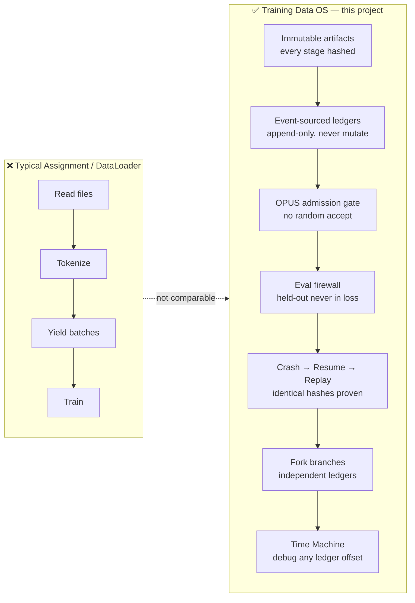
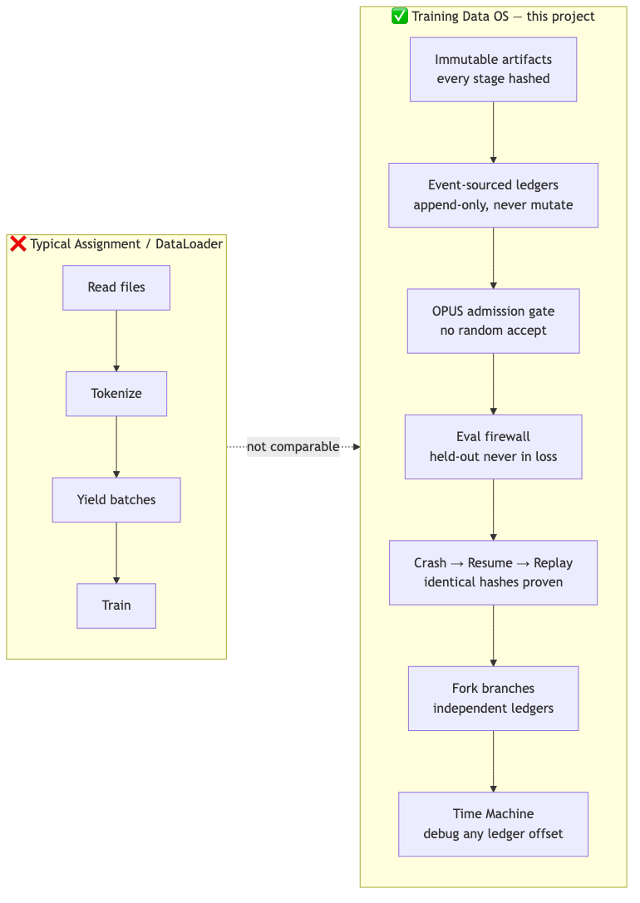
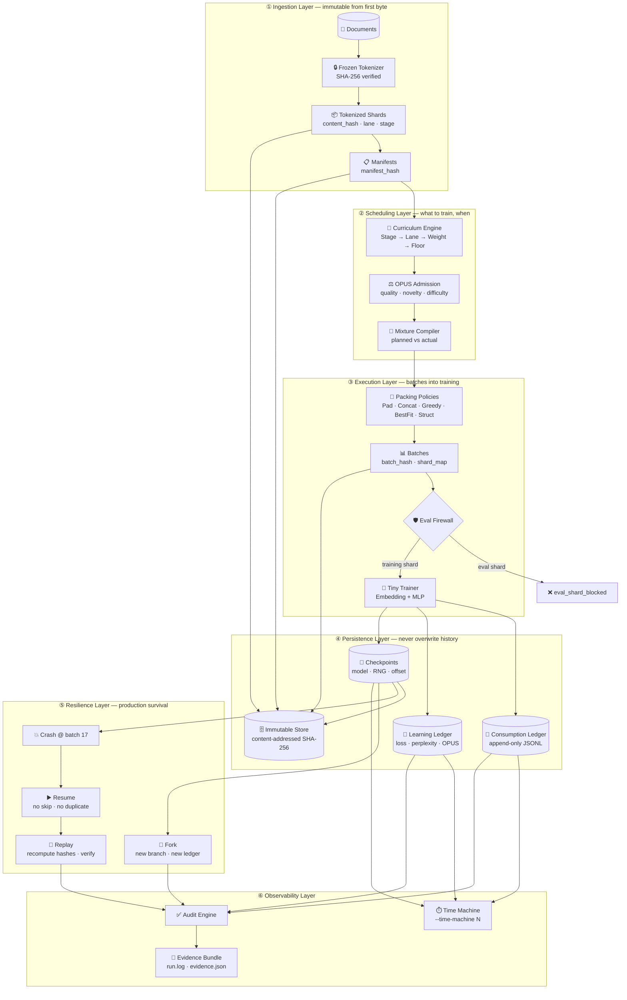
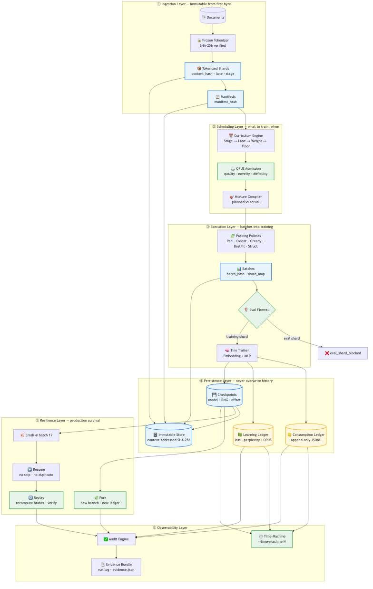
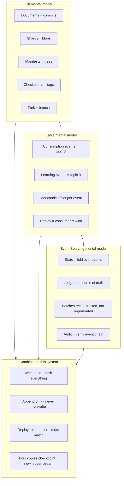
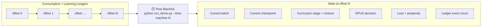
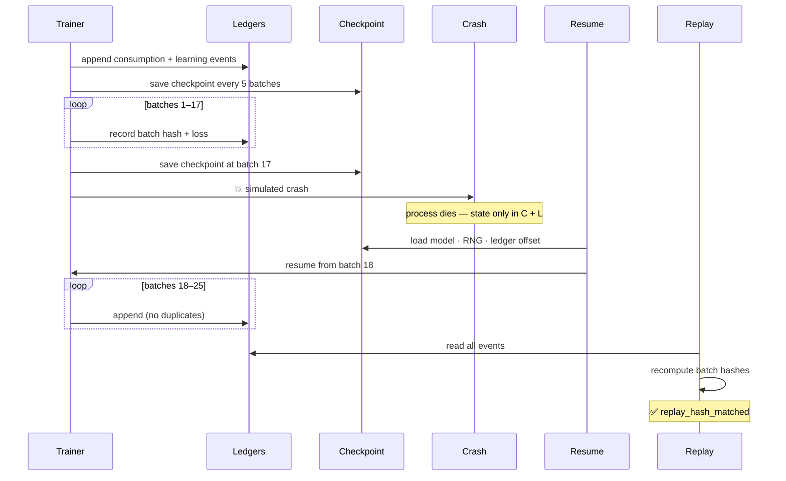

# Session 6 — Training Data Execution System

A miniature production-grade **Training Data Operating System** that models the full lifecycle of LLM training data: from raw documents through tokenization, sharding, curriculum scheduling, OPUS admission control, packing, fake training, ledger-based consumption tracking, checkpoint/resume, replay verification, fork/branch, and audit.

> This is not a data loader. This is an event-sourced training data OS.

## Unique Differentiators

This is **not a DataLoader**. The table below contrasts what reviewers typically see in an assignment vs what this system implements.

| | Typical `DataLoader` | Training Data OS (this project) |
|---|---|---|
| **Data model** | Mutable files on disk | Immutable, content-addressed artifacts (SHA-256) |
| **History** | Overwritten silently | Append-only ledgers — never mutate past events |
| **Admission** | Take everything | OPUS scores every shard — Accept / Reject / Deferred / Protected Override |
| **Eval leakage** | Often ignored | Eval firewall — held-out shards blocked from loss-bearing batches |
| **Crash recovery** | Restart from scratch | Checkpoint + resume — no skipped or duplicated batches |
| **Reproducibility** | Re-run and hope | Replay reads ledger, recomputes hashes, proves identity |
| **Experimentation** | Change code, lose trace | Fork from checkpoint — independent branch + independent ledger |
| **Debugging** | Print statements | Time Machine — inspect full state at any ledger offset |

### vs. a typical assignment





### The five things no assignment does

| # | Differentiator | Why it matters |
|---|----------------|----------------|
| 1 | **Immutable event log** | Every training decision is auditable months later |
| 2 | **OPUS + protected floors** | Low-resource lanes (e.g. Indic) cannot be starved by the scheduler |
| 3 | **Eval firewall** | Benchmark contamination is a real production failure mode |
| 4 | **Hash-verified replay** | Prove re-runs are identical without trusting the trainer |
| 5 | **Time Machine** | Debug "what was the model eating at step N?" without re-running |

## Quick Start

```bash
cd session6/project
python3 run_demo.py
```

**Push to GitHub** (if port 22 is blocked on your network):

```bash
# from repo root
bash scripts/push.sh
```

See [`session6/PUSH.md`](PUSH.md) for all push methods.

Time machine (debugger for training state at ledger offset N):

```bash
python3 run_demo.py --time-machine 45
```

Run tests:

```bash
python3 -m pytest tests/ -v
# or
python3 -m unittest discover -s tests -v
```

## Architecture

> Diagrams use [Mermaid](https://mermaid.js.org/) — they render natively on GitHub, GitLab, and Cursor.  
> Source: [`assets/*.mmd`](assets/). PNG/SVG exports: `bash scripts/render_diagrams.sh` (uses `npx @mermaid-js/mermaid-cli`)

### System overview





Every artifact is **immutable** and **content-addressed** (SHA-256). Every decision is **logged**. Every replay **recomputes hashes** and verifies identity — it never regenerates batches.

### Design Philosophy

| Principle | Implementation |
|-----------|----------------|
| Immutability | Append-only ledgers, write-once artifact store |
| Determinism | Fixed seeds, LCG RNG, frozen tokenizer |
| Traceability | Consumption + learning ledgers with hashes |
| Reproducibility | Replay engine reconstructs from ledger |
| Extensibility | Pluggable packing policies, curriculum stages |

### Folder Structure

```
project/
├── core/                    # Engine modules
│   ├── tokenizer_engine.py  # Frozen tokenizer
│   ├── shard_engine.py      # Immutable tokenized shards
│   ├── manifest_engine.py   # Shard aggregation manifests
│   ├── curriculum_engine.py # Timeline mixture compiler
│   ├── opus_engine.py       # Quality admission control
│   ├── packing_engine.py    # 5 pluggable packing policies
│   ├── batch_engine.py      # Batch construction + eval firewall
│   ├── trainer_engine.py    # Fake training orchestration
│   ├── checkpoint_engine.py # Immutable checkpoints
│   ├── replay_engine.py     # Ledger-based replay verification
│   ├── fork_engine.py       # Branch from checkpoint
│   ├── audit_engine.py      # Full execution audit
│   └── metrics_engine.py    # Performance reporting
├── ledger/                  # Event-sourced ledgers
│   ├── event_store.py       # JSONL append-only events
│   ├── consumption_ledger.py
│   └── learning_ledger.py
├── models/
│   └── tiny_model.py        # Embedding + MLP (no torch)
├── storage/
│   ├── immutable_store.py   # Content-addressed artifacts
│   └── hash_utils.py        # SHA-256 utilities
├── submission_artifacts/    # Generated evidence bundle
├── run_demo.py              # Full pipeline entry point
└── tests/                   # Automated test suite
```

## Execution Flow

1. **Tokenizer** — Build vocabulary from documents, freeze, verify hash
2. **Shards** — Tokenize documents into immutable shards with full metadata
3. **Manifests** — Aggregate shards into hash-verified manifests
4. **Curriculum** — Compile stage-based mixture (planned vs actual)
5. **OPUS** — Score every candidate (quality, novelty, difficulty); record decisions
6. **Eval Firewall** — Block evaluation shards from loss-bearing batches
7. **Packing** — Greedy packing (switchable to 4 other policies)
8. **Training** — Forward/loss on tiny model; record to both ledgers
9. **Crash** — Simulated crash after batch 17
10. **Resume** — Restore from checkpoint; continue without duplicates
11. **Replay** — Reconstruct batches from ledger; verify hash identity
12. **Fork** — Branch from checkpoint with different packing policy
13. **Audit** — Verify all invariants; generate evidence bundle

## Deep Dives

### Git + Kafka + Event Sourcing

The design borrows three production patterns and applies them to training data:



### Time Machine — debugger for training data



```bash
python3 run_demo.py --time-machine 45
# → current batch, checkpoint, curriculum, OPUS decision, loss, perplexity
```

### Crash → Resume → Replay



### OPUS, Eval Firewall, Packing

- **OPUS** — Every shard scored on quality, novelty, difficulty. Decisions: Accept, Reject, Deferred, Protected Override. No random acceptance.
- **Eval Firewall** — Evaluation shards blocked from loss-bearing batches (`eval_shard_blocked`).
- **Packing** — Five switchable policies: `PadOnly`, `Concatenate`, `Greedy`, `BestFit`, `StructurePreserving`.

## Deterministic Execution

- Frozen tokenizer with verified SHA-256 hash
- LCG pseudo-random number generator (no `random` module)
- Content-addressed artifacts in immutable store
- Replay recomputes batch hashes without regeneration

## Submission Artifacts

After `run_demo.py`, find in `submission_artifacts/`:

| File | Description |
|------|-------------|
| `run.log` | PASS/FAIL log for every check |
| `evidence.json` | Machine-readable evidence bundle |
| `evidence.md` | Human-readable evidence report |
| `performance.json` | Packing %, tokens/sec, timing metrics |
| `ledgers/` | Consumption + learning JSONL |
| `checkpoints/` | Training checkpoints |
| `manifests/` | Shard manifests |

### Diagram source files

| Diagram | Mermaid source |
|---------|----------------|
| System architecture (6 layers) | [`assets/architecture.mmd`](assets/architecture.mmd) |
| vs. typical assignment | [`assets/differentiators.mmd`](assets/differentiators.mmd) |
| Git + Kafka + event sourcing | [`assets/event-sourcing.mmd`](assets/event-sourcing.mmd) |
| Time Machine | [`assets/time-machine.mmd`](assets/time-machine.mmd) |
| Crash / resume / replay | [`assets/resilience.mmd`](assets/resilience.mmd) |
