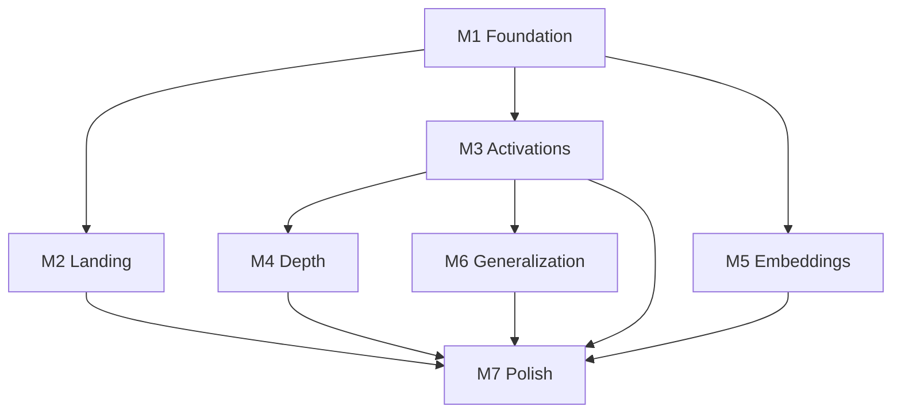

# Neural Truth Lab — Milestones

## Overview

Seven milestones from foundation to production polish. Each milestone has clear deliverables and acceptance gates. Do not start the next milestone until the current gate passes.

```
M1 Foundation ──► M2 Landing ──► M3 Lab1 ──► M4 Lab2 ──► M5 Lab3 ──► M6 Lab4 ──► M7 Polish
```

---

## Milestone 1 — Foundation

**Theme:** Architecture · Design System · Theme · Navigation

### Deliverables

| Item | Output |
|------|--------|
| Project scaffold | Next.js 15, React 19, TypeScript, Tailwind, ESLint, Prettier |
| shadcn/ui | Initialized with dark theme tokens |
| Theme | CSS variables, glass utilities, gradient tokens per `ui-design.md` |
| Layout | `RootLayout`, sticky glass header, footer |
| Navigation | Routes scaffolded: `/`, `/labs`, `/lab/*`, `/about` |
| ThemeProvider | Dark default |
| Folder structure | `app/`, `components/`, `hooks/`, `lib/`, `types/` per `architecture.md` |
| Fonts | Geist or Inter + mono |
| Progress storage | `localStorage` stub |

### Acceptance Gate

- [x] `npm run dev` starts without errors
- [x] `npm run build` succeeds
- [x] All routes render placeholder content
- [x] Header nav works; glass styling visible
- [x] Dark theme tokens applied globally
- [x] Responsive header at mobile/desktop

### Estimated Scope

~1–2 days

---

## Milestone 2 — Landing Page

**Theme:** Landing Page · Particle Engine · Hero

### Deliverables

| Item | Output |
|------|--------|
| Hero | Title, subtitle, gradient text, CTA |
| `HeroAnimation` | Particle/neural canvas, mouse repel, lazy loaded |
| Lab cards | Four cards with accent colors, hover animations |
| CTA | "Start Experiment" → `/labs` or first lab |
| Section animations | Stagger entrance per `animations.md` |
| `/labs` page | Grid of four lab cards with descriptions |

### Acceptance Gate

- [x] Particle background runs at 60fps on desktop
- [x] Mouse interaction repels nodes
- [x] Hero text entrance animates
- [x] Cards hover lift + glow
- [x] CTA navigates correctly
- [x] `prefers-reduced-motion` disables particles
- [ ] Lighthouse performance > 80 (landing only) — verify locally with Chrome DevTools

### Estimated Scope

~2–3 days

---

## Milestone 3 — Activation Lab

**Theme:** Activation Lab (Lab 1)

### Deliverables

| Item | Output |
|------|--------|
| `concentric-rings.ts` | Dataset generator with seed |
| Models | Linear vs ReLU classifiers |
| `useTraining` hook | Epoch loop, snapshot history |
| `DecisionBoundary` | Grid inference, contour, morph animation |
| `LossChart` / `AccuracyChart` | D3 animated charts |
| `EpochSlider` | Scrub timeline |
| Lab page | Full section layout per `lab1.md` |
| Side-by-side | Model A vs Model B comparison |
| Confusion matrix | 2×2 per model |
| Key insight card | Appears on completion |
| Progress | Mark lab complete in storage |

### Acceptance Gate

- [x] All items in `lab1.md` acceptance criteria pass (boundary morph animation deferred — instant epoch updates)
- [x] Model A ~50% acc; Model B >95% acc on default seed (verify in browser)
- [x] Decision boundary updates per epoch via scrubber and live training
- [x] UI does not freeze during training (`tf.nextFrame` between epochs)
- [x] Replay + PNG export work

### Estimated Scope

~3–4 days

---

## Milestone 4 — Depth Lab

**Theme:** Depth Lab (Lab 2)

### Deliverables

| Item | Output |
|------|--------|
| Three models | 1-linear, 5-linear, 5-ReLU |
| `WeightMatrix` | Heatmap component |
| `weight-collapse.ts` | Matrix multiply + product |
| Collapse animation | 5 → 1 matrix visual |
| `NeuralNetworkView` | Layer schematic + collapse |
| Comparison grid | 3-panel decision boundaries |
| Lab page | Full layout per `lab2.md` |
| Compare All flow | Sequential train with progress |

### Acceptance Gate

- [x] All items in `lab2.md` acceptance criteria pass
- [x] Models 1 & 2 similar boundaries; Model 3 curves (verify in browser)
- [x] Weight collapse animation plays correctly
- [x] W product numerically computed and displayed

### Estimated Scope

~3–4 days

---

## Milestone 5 — Embedding Universe

**Theme:** Embedding Lab (Lab 3)

### Deliverables

| Item | Output |
|------|--------|
| `synthetic-language.ts` | Corpus + templates |
| `embedding-lm.ts` | Embedding + softmax model |
| `embedding-projection.ts` | PCA (t-SNE optional) |
| `EmbeddingGalaxy` | 2D star field with tween |
| `SimilarityCard` | Neighbors + cosine similarity |
| Lab page | Full layout per `lab3.md` |
| Category colors | Animals, fruit, verbs |

### Acceptance Gate

- [ ] All items in `lab3.md` acceptance criteria pass
- [ ] Clusters visible by epoch 150+
- [ ] Hover neighbors semantically sensible
- [ ] Star positions animate smoothly

### Estimated Scope

~3–4 days

---

## Milestone 6 — Generalization Arena

**Theme:** Generalization Lab (Lab 4)

### Deliverables

| Item | Output |
|------|--------|
| `noisy-classification.ts` | Dataset at 4 sizes |
| `large-mlp.ts` | Overparameterized MLP |
| `GeneralizationGraph` | Dual loss + gap shading |
| Size slider | 20 / 200 / 2000 / 20000 |
| Pre-cache or on-demand | Train all sizes |
| Gap metric card | Animated number |
| Web Worker | For size 20000 training |
| Lab page | Full layout per `lab4.md` |

### Acceptance Gate

- [ ] All items in `lab4.md` acceptance criteria pass
- [ ] Gap large at 20, small at 20000
- [ ] Slider switches between runs smoothly
- [ ] No UI freeze on largest dataset

### Estimated Scope

~3–5 days

---

## Milestone 7 — Polish

**Theme:** Polish · Animations · Accessibility · Performance · Deployment

### Deliverables

| Category | Items |
|----------|-------|
| **Animations** | Audit all pages against `animations.md`; reduced motion pass |
| **Accessibility** | Keyboard shortcuts, focus rings, aria labels, skip link |
| **Global features** | Achievements, progress ring, fullscreen, share screenshot, download PNG |
| **Performance** | Lazy loading audit, memoization, TF.js dispose audit, Worker integration |
| **About page** | Credits, tech stack, links |
| **Documentation** | README, architecture diagram, deployment guide |
| **Deployment** | `netlify.toml`, GitHub Actions (lint, typecheck, build) |
| **SEO** | Meta tags, OG image |
| **QA** | Full manual test pass all labs |

### Acceptance Gate

- [ ] All labs completable end-to-end
- [ ] Keyboard shortcuts work (documented in `?` dialog)
- [ ] `prefers-reduced-motion` fully supported
- [ ] Lighthouse: Performance > 75, Accessibility > 90
- [ ] CI green on push
- [ ] Netlify deploy succeeds
- [ ] README documents local dev + deploy
- [ ] No console errors in production build

### Estimated Scope

~3–5 days

---

## Total Timeline Estimate

| Milestone | Days |
|-----------|------|
| M1 Foundation | 1–2 |
| M2 Landing | 2–3 |
| M3 Lab 1 | 3–4 |
| M4 Lab 2 | 3–4 |
| M5 Lab 3 | 3–4 |
| M6 Lab 4 | 3–5 |
| M7 Polish | 3–5 |
| **Total** | **18–27 days** |

---

## Dependency Graph



M3 (Activations) is the **template lab** — hooks, charts, decision boundary, and training loop built here are reused in M4 and M6.

---

## Risk Register

| Risk | Mitigation |
|------|------------|
| TF.js blocks UI | Web Worker from M3 onward |
| t-SNE too slow | PCA default; t-SNE on-demand only |
| 20000 sample train slow | Pre-cache on lab load with progress UI |
| Scope creep | Strict v1 non-goals in `vision.md` |

---

## Definition of Done (Project)

The project is complete when:

1. All seven milestone acceptance gates pass
2. Four labs demonstrate their truths interactively
3. Landing page feels premium
4. Deployed to Netlify with CI
5. README and specs are current
